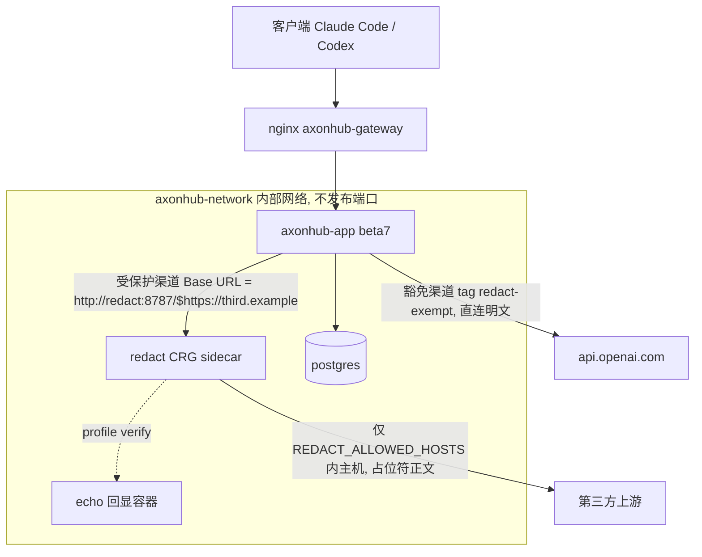
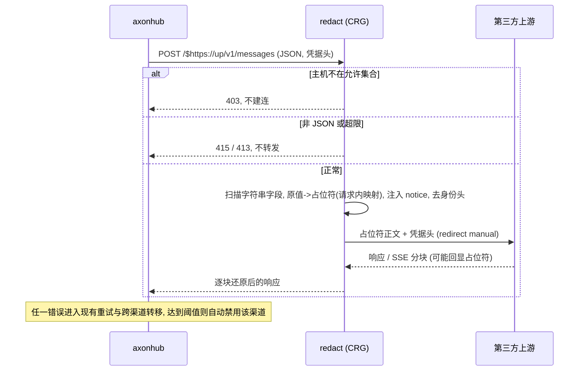
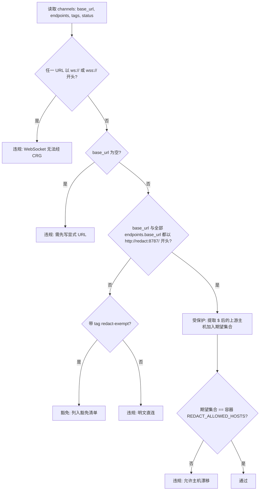

# 中转站出站隐私脱敏层 - Plan

**Target repo:** 本仓库（owner 的 axonhub fork）。所有仓库内产物位于 `deploy/privacy-redaction/`。服务器侧路径（如 `/srv/apps/axonhub/`）只出现在 runbook 步骤中，属于服务器文件系统，不是仓库路径。

## Goal Capsule

- **目标**：把 CosyRedactGateway（下称 CRG）作为 sidecar 接入服务器现有 axonhub compose，让所有受保护渠道的出站请求先经 CRG 做可逆脱敏再到第三方上游；客户端、axonhub 代码与镜像零改动。
- **推荐方案**：在每条受保护渠道现有 Base URL 前加封套前缀 `http://redact:8787/$`，由 axonhub 原有的字符串拼接逻辑生成 `http://redact:8787/$https://<上游>/v1/messages` 形式的完整 URL；CRG 解析 `$` 之后的上游地址、脱敏正文、转发并在回程还原。豁免渠道用渠道 tag `redact-exempt` 标注并保持直连。
- **决策焦点**：KTD-1（封套前缀而非逐端点 `##`）、KTD-3（tag 作豁免标记 + 核对脚本按 URL 与 tag 双条件判定）、KTD-7（fail-closed 与渠道自动禁用的交互及恢复路径）。
- **验证焦点**：仓库内本地 docker 冒烟证明「占位符替换、同值同占位符、非 JSON 拒绝、主机白名单拒绝、身份头清理」；服务器灰度阶段用受控回显上游与真实模型往返完成 AE-01～AE-11，写入验收记录。
- **最大风险 / 边界**：真实 Claude Code 工具调用流式往返经 CRG 后的行为（AE-09）只能在服务器上证明；脱敏层宕机会让受保护渠道因全局自动禁用策略被禁用，恢复必须是显式操作。任何情况下不得把受保护渠道回退为直连来让验收通过。
- **权威层级**：需求文档的 Product Contract（owner 已答复 OQ-1～OQ-7）> 线上 `v1.0.0-beta7` 源码事实 > CRG 锁定提交 `dfce67a17c30` 源码事实 > 本计划的推断。
- **执行档案**：U1～U5 由 `spec-work` 在仓库内完成并本地冒烟；U6 是 owner 在服务器上按 runbook 执行的灰度与验收，`spec-work` 到 U5 交付即停。
- **停止条件**：发现 axonhub beta7 对含 `$` 的 Base URL 拼接与本计划所读源码不一致；发现 CRG 无法在容器内监听非回环地址；回显阶段 AE-01 失败（回显日志出现原值）。任一情况停止并回到本计划修订，不得绕过。

---

## Product Contract

来源：`docs/brainstorms/2026-09-12-001-feat-privacy-redaction-gateway-requirements.md`（`spec-prd` 产出，`can_enter_spec_plan: yes`，OQ-1～OQ-7 全部由 owner 答复并 closed）。以下按 origin 原意整理，R/BR/AE 编号沿用 origin。

### Summary

为中转站 owner 在「请求离开自己的服务器、发往第三方中转站上游之前」增加一层可逆脱敏：命中检测器的密钥与个人信息在出站时被替换为不可逆推的占位符，上游只看到占位符；上游回显占位符时在返回客户端前还原为原值。客户端与渠道凭据零改动，脱敏层不可用时宁可失败也不明文外发。

### Problem Frame

owner 的 axonhub 汇集 27 个渠道，其中 26 个是第三方中转站；近 30 天 6400+ 次 Claude Code / Codex 请求把代码、配置、工具结果原文直接发给这些上游，上游是否存储、检视、转卖不可控。近期公开的第三方中转站窃取隐私与钱包资产事件，使 owner 无法再把「上游不会看」当默认假设。不做的风险是任何一次含 API key、云凭据、私钥块或证件号的对话都可能被不可信上游留存；现有零配置的内置规则等于没有防护。业务价值是把「信任上游」改成「默认不信任上游」，且不牺牲现有客户端体验与渠道调度能力。

### Current System Snapshot

- 部署：官方镜像 `looplj/axonhub:v1.0.0-beta7`，docker compose 三容器 nginx（`axonhub-gateway`，宿主 `127.0.0.1:8020`）→ axonhub（`axonhub-app`，8090）→ postgres（`axonhub-postgres`），同一 bridge 网络 `axonhub-network`；容器已做 `read_only`、`cap_drop: ALL`、`no-new-privileges`、tmpfs `/tmp` 加固。部署文件 `/srv/apps/axonhub/{docker-compose.yml,nginx.conf,.env}` 不在任何 git 仓库内。
- 渠道：27 个，类型为 `anthropic`、`openai_responses`、`zhipu_anthropic`、`deepseek`、`xai`、`openai`；26 个第三方中转站 + 1 个官方 `api.openai.com`（id 26，名称 `openai`）；1 个已归档。
- 使用者：1 个 API key（`self`）；客户端 Claude Code（Anthropic Messages）与 Codex（OpenAI Responses）；近 30 天请求 100% 为 JSON 协议，无音频/文件端点流量。
- 出站脱敏：无；内置 Prompt Protection Rules 0 条。请求/响应正文全部存档在本机 Postgres。
- 渠道 Base URL 规则：`#` 后缀关闭版本号追加，`##` 完全原样（`docs/en/guides/channel-management.md`）。
- 宿主机只有 docker 29.1.3，无 node / deno。公网入口经 Cloudflare 头推断走隧道（source-candidate，不影响本期）。

### Change Delta

- keep：客户端接入方式、唯一 API key、三种入站协议与流式行为；渠道凭据、渠道选择、负载均衡、故障转移、追踪；axonhub 镜像 `v1.0.0-beta7` 与代码；内置规则保持 0 条；本机 Postgres 明文存档（记为已知风险）。
- add：一个独立的可逆脱敏 sidecar（CRG），只在本机内部网络可达；一条可复现的验证路径（受控回显上游 + 真实模型往返）。
- replace：受保护渠道的出站目的地，由直连第三方上游改为经脱敏层再到上游。
- extend：渠道信任标记，可辨识哪些渠道被显式豁免、哪些受保护。
- remove：无。

### Change Topology

- 主拓扑：`add`（新增出站前置组件）+ `replace`（受保护渠道出站目的地）+ `policy-change`（信任边界默认值）。
- 承重面：渠道出站配置（axonhub 控制台）、服务器 docker compose、脱敏层运行参数。客户端 API、admin API、入站鉴权不在改动面。
- 生产者 / 消费者：客户端 → axonhub（原文）；axonhub → 脱敏层（已协议转换的上游请求）；脱敏层 → 第三方上游（占位符版本）；上游 → 脱敏层（可能含占位符的响应）→ axonhub → 客户端（已还原）。豁免渠道保持 axonhub 直连。
- 权威来源：哪些渠道受保护 / 豁免 = axonhub 渠道配置（出站是否经脱敏层）+ 渠道标记，两者必须一致且可核对；敏感值 ↔ 占位符映射 = 脱敏层请求内内存，不落盘、不跨请求、不可查询；允许的上游主机集合 = 脱敏层运行配置，应与受保护渠道主机集合一致；请求原文历史 = 本机 Postgres，本期不动。
- 负空间风险：新增渠道若绕过脱敏层即形成明文旁路（R-04 / R-05 / AE-07）。

### Glossary

- 中转站：owner 自建的 axonhub 实例。上游 / 渠道：axonhub 中的 channel。脱敏层：本期新增的 CRG sidecar 进程。
- 受保护渠道：出站必须经脱敏层的渠道，默认所有渠道。豁免渠道：owner 显式标记为可信、允许直连的官方直连渠道，当前仅 `api.openai.com`。
- 占位符：形如 `{{Redact:64位十六进制摘要}}` 的替换串，不可逆推原值。还原：上游回显占位符时在返回客户端前替换回原值。检测器：CRG 的七类规则 H/P/S/I/B/E/G。

### Actors

- A1 owner（管理员 + 唯一使用者）：日常用 Claude Code / Codex 经中转站调用模型，偶尔新增/调整渠道，抽查脱敏是否生效；拥有 axonhub 全部管理权限与服务器 root。目标是不改变使用习惯的前提下让第三方上游拿不到原始敏感值。
- A2 客户端（Claude Code / Codex）：发起三种协议的流式/非流式请求，含工具调用与工具结果；只持有中转站 API key；行为须与现状一致。
- A3 第三方上游：视为不可信，可能存储与检视一切收到的内容。
- A4 脱敏层：位于 axonhub 与受保护上游之间；只在内部网络可达；仅允许既定上游主机。

### Requirements

**出站脱敏与回程还原**

- R-01. 当请求被路由到任一受保护渠道时，系统应在请求离开本服务器前把正文中命中已启用检测器的敏感值替换为不可逆推的占位符再转发；同一请求内同一原值映射为同一占位符。上游收到的正文不含原始敏感值，客户端无感知。（P0）
- R-02. 当上游在普通文本、JSON、流式增量或工具调用参数中原样回显占位符时，系统应在返回客户端前还原为原值；流式响应逐块还原，不整体缓冲。（P0）
- R-03. 脱敏层处理任一受保护渠道请求时应启用全部七类检测器（高熵串、手机号、`sk-` 密钥、PRC 身份证、银行卡、邮箱、Gitleaks 兼容规则包），覆盖消息文本、工具输入、工具结果及其它字符串字段；图片/音频等二进制字段不检查。未命中类别（含钱包助记词）原样发出。（P0，可降级为只开 S/G/H 但需 owner 重新确认，OQ-3 已否决）

**信任边界**

- R-04. 渠道被创建或启用时默认视为受保护渠道；只有 owner 显式标记为豁免渠道的官方直连渠道可不经脱敏层。（P0）
- R-05. owner 需要核对信任边界时，应能得到「当前未经脱敏层的渠道」清单，且清单只应包含被显式豁免的渠道。（P1，首期可用一条手工核对命令代替控制台标记）
- R-07. 脱敏层收到指向未配置上游主机的转发请求时应拒绝且不建立上游连接；脱敏层只在本机内部网络可达，不对公网暴露。（P0）

**失败语义**

- R-06. 脱敏层不可用、返回错误，或因请求体非 JSON / 超体积上限 / 超替换上限而拒绝时，该次对受保护渠道的上游尝试应失败；系统可按现有故障转移到其它受保护渠道或豁免渠道；任何情况下不得把明文正文发往受保护渠道上游。（P0，fail-open 已被 OQ-4 否决）

**协议与头**

- R-08. 脱敏层转发请求时应原样转发渠道凭据与上游协议头；应移除代理/网络身份类头（转发 IP、Cookie、CF-*、Sec-*）；不跟随上游重定向。（P1，头清理若与某上游鉴权冲突可按渠道豁免并记录）
- R-10. 客户端以 Anthropic Messages、OpenAI Responses 或 OpenAI Chat Completions 访问时，请求形状、鉴权方式、工具调用与流式行为保持不变。（P0）

**可验证性**

- R-09. owner 执行验收或例行抽查时，应能用一条可复现路径证明脱敏与还原确实发生：受控回显上游看到的是占位符、真实模型往返得到原值；得到明确的通过 / 不通过结论。（P1，首期至少完成一次人工验证并记录）

**业务规则**

- BR-001. 受保护渠道 = 默认所有渠道；豁免渠道 = owner 显式标记为可信的官方直连渠道，当前仅 `api.openai.com`（id 26）。
- BR-002. 加密钱包助记词（12/24 个自然单词）不在本期检测范围；owner 的行为约束是不在提示词、文件或工具结果中出现助记词。hex 私钥与 `0x` 地址预期由高熵检测器命中，但未实测。
- BR-003. 敏感值与占位符的映射只存在于脱敏层处理该请求的内存中；不落盘、不写日志、不跨请求复用、不可事后查询。
- BR-004. 上游改写（截断、拼错）占位符导致无法还原时，改写后的字符串原样透传给客户端；不重试、不报错。
- BR-005. 把任一受保护渠道恢复为直连（回滚）必须是 owner 的显式操作并留有变更记录；不得因脱敏层故障而自动发生。

### Acceptance Examples

- AE-01（R-01、R-03）
  - **Given** 一条受保护渠道的上游临时指向 owner 控制的回显服务
  - **When** 发送一条用户消息与一条工具结果，含伪造 `sk-` 密钥、邮箱、PRC 手机号、PEM 私钥块，且伪造密钥出现两次
  - **Then** 回显服务记录到的正文里这些值全部是 `{{Redact:64位十六进制摘要}}` 形式，原值一次都不出现，两次伪造密钥映射为同一占位符
- AE-02（R-02、R-09）
  - **Given** 一条真实的受保护第三方渠道
  - **When** 用户消息要求模型「原样复述下面这个密钥」并给出伪造 `sk-` 密钥
  - **Then** 客户端收到的回复里是该伪造密钥的原值，而不是占位符
- AE-03（R-02、R-10）
  - **Given** 流式请求经受保护渠道发出
  - **When** 上游把一个占位符切分在多个 SSE 事件 / HTTP 块中回显
  - **Then** 客户端收到完整还原后的原值；首个输出块在上游首块到达后即发出，不等待整个响应
- AE-04（R-06）
  - **Given** 脱敏层进程已停止，且存在另一条可用的受保护渠道或豁免渠道
  - **When** 请求被路由到一条受保护渠道
  - **Then** 该渠道的尝试失败；请求按现有故障转移策略切到另一条渠道；回显 / 抓包证明第三方上游没有收到任何明文正文
- AE-05（R-06，异常）
  - **Given** 受保护渠道
  - **When** 请求体为非 JSON（例如 multipart 音频上传）
  - **Then** 请求被拒绝并返回错误，不转发到上游
- AE-06（R-07）
  - **Given** 脱敏层配置了允许的上游主机集合
  - **When** 收到一条指向集合外主机的转发请求
  - **Then** 返回拒绝，且不向该主机发起任何连接
- AE-07（R-04、R-05）
  - **Given** 27 个渠道，只有官方 openai（id 26）被 owner 标记为豁免
  - **When** owner 核对「未经脱敏层的渠道」清单
  - **Then** 清单只含官方 openai 一条；任一第三方渠道出现在清单中即判为不通过
- AE-08（R-08）
  - **Given** 受控回显上游
  - **When** 经受保护渠道发送请求
  - **Then** 回显记录包含渠道凭据头且上游鉴权成功；不包含 `X-Forwarded-For`、`X-Real-IP`、`CF-Connecting-IP`、`Cookie`
- AE-09（R-10）
  - **Given** Claude Code（Anthropic Messages）与 Codex（OpenAI Responses）保持现有配置
  - **When** 不改任何客户端配置发起含工具调用的流式对话
  - **Then** 对话正常完成，工具调用参数与工具结果往返正确，与启用前体验一致
- AE-10（R-03，负向，BR-002）
  - **Given** 受保护渠道 + 受控回显上游
  - **When** 用户消息中含 12 个 BIP39 英文单词组成的助记词
  - **Then** 回显正文中助记词原样出现（已声明的边界，用于确认文档口径与行为一致，不是缺陷）
- AE-11（BR-004）
  - **Given** 真实模型渠道
  - **When** 模型在回复中改写了占位符（例如截断为 `{{Redact:abc`）
  - **Then** 客户端收到改写后的字符串原样；请求不重试，不返回错误

### Negative Acceptance

- 不得为了让 AE-04 通过而把任何受保护渠道回退为直连；回退只能是 BR-005 的显式操作。
- 不得在脱敏层、nginx 或 axonhub 日志中新增请求正文、占位符映射或运行时盐的输出。
- 不得改变客户端可见的 API 路径、鉴权头或错误格式（上游错误仍按 axonhub 现有方式透传）。
- 不得修改 axonhub 代码或替换镜像版本来实现本期需求（OQ-7）。
- 不得把豁免渠道以外的任何渠道排除在脱敏层之外，即使它「看起来可信」。

### Scope Boundaries

**本期做**

- 以 CRG 作为可逆脱敏层，以独立 sidecar 形式加入服务器现有 axonhub compose，只在内部网络可达（OQ-1、OQ-7）。
- 所有 26 个第三方渠道纳入受保护渠道；官方 `api.openai.com` 渠道作为唯一豁免渠道（OQ-2）。
- 启用全部七类检测器（OQ-3）；fail-closed 失败语义与故障转移边界（OQ-4）；一条可复现验证路径与验收记录（OQ-5）；渠道信任边界可核对性（R-05）与新增渠道流程约束。

**本期不做（Non-Goals）**

- 钱包助记词、钱包地址、WIF 私钥的专用检测（BR-002）。
- 运行时「是否发生脱敏 / 替换了多少个值」的可见信号或审计事件（OQ-5）。
- 本机 Postgres 中请求/响应正文明文存档的加密、脱敏或保留期限治理（OQ-6）。
- 上游响应中的恶意指令 / 提示注入防护（脱敏层只处理出站泄露方向）。
- 配置或启用 axonhub 内置 Prompt Protection Rules（OQ-1；保留为后续可选补充）。
- 图片、音频、文件等二进制内容的检查；非 JSON 端点的支持（现状无此流量，fail-closed 已接受）。
- 修改 axonhub 代码、自建镜像、把脱敏层放在客户端与 axonhub 之间（OQ-7）。
- 多用户 / 多租户差异化策略。

**与其它模块的关系**

- 依赖 axonhub 渠道 Base URL 自定义能力（`docs/en/guides/channel-management.md` §Base URL Special Configuration）。
- 与内置 Prompt Protection Rules 可叠加：内置规则在选渠道之后、调上游之前生效，脱敏层在其后；本期不配置。
- 后续候选：本机存档治理（可复用 `config.example.yml` 的 `gc` 与 DataStorage 能力）。
- 跨地区 / 市场 / tenant：不涉及。

### Exception Handling

- 脱敏层进程不可用：受保护渠道尝试失败，按现有策略转移到其它受保护/豁免渠道；无可用渠道则请求失败；可能触发渠道自动禁用（恢复路径见 KTD-7 与 runbook）。
- 上游不可用 / 5xx：脱敏层原样透传上游错误，与现状一致。
- 请求体非 JSON：脱敏层拒绝（415），不转发；不可重试，需改用 JSON 端点。
- 请求体超体积上限（默认 16 MiB）或唯一敏感值数量超上限（默认 16384）：拒绝（413），不转发。
- 上游返回重定向：不跟随，按错误处理。
- 模型改写占位符：原样透传（BR-004），用户自行重问。
- 脱敏层重启导致运行时盐变化：后续请求生成不同占位符，功能不受影响；上游侧提示缓存前缀失效。
- 新增渠道未纳入受保护集合：该渠道明文直连，属于配置错误；R-05 清单可发现；已外发内容不可撤回。

### Data / Compliance Boundaries

- 请求正文中的密钥/令牌/私钥块与 PRC 身份证号、手机号、银行卡号、邮箱：上游只见占位符，客户端见原值；出站替换、回程还原；脱敏层不保存；本机 Postgres 现状明文，本期不动。
- 占位符 ↔ 原值映射与运行时盐：不可见、仅进程内存态，不落盘、不记录、不导出。
- 渠道凭据：经内部网络原样转发到上游，与现状一致。
- 请求/响应正文存档：与现状一致（控制台可见），本期不动，后续候选。

### 非功能需求

- 性能 / 时延：流式首块与整体完成时间不因脱敏层出现 owner 可感知的恶化；验收时对同一渠道、同一提示词各测 3 次，记录启用前后首块时延与总时长（不阻塞，记录即可）。
- 并发 / 容量：单用户场景；单请求体上限 16 MiB；大文件工具结果（≥1 MiB）往返成功。
- 可用性：脱敏层是受保护渠道的单点，进程异常退出后应自动拉起（阻塞上线）；不可用期间行为按 R-06。
- 安全：只在内部网络可达；只允许既定上游主机；不跟随重定向；渠道凭据不经公网多余一跳（AE-06、AE-08，阻塞上线）。
- 隐私 / 合规：映射与盐不持久化、不记录；上游不再收到命中类别的原值（AE-01、日志检查，阻塞上线）。
- 可观测：本期不要求脱敏事件信号；进程存活与错误率沿用容器健康检查。
- 成本：占位符（约 75 字符）与固定英文提示注入使上游 token 略增；脱敏层重启使上游提示缓存前缀失效；不设目标值。

### Release / Operation Readiness

- 灰度策略（阻塞上线）：先只把一条第三方渠道切到脱敏层并完成 AE-01～AE-03、AE-08、AE-09，再切其余 25 条。
- 老版本兼容：客户端零改动；axonhub 版本不变。存量数据：无迁移。
- 运营 SOP：新增渠道先纳入受保护集合或显式豁免再启用（R-04）；定期执行 R-05 核对。
- 版本锁定：脱敏层锁定到已验收的具体提交（v0.3.0 / `dfce67a17c30`），升级需重跑 AE-01～AE-03。
- 回滚：显式把渠道恢复直连（BR-005），客户端无感知但隐私防护随之消失，需记录。
- 部署配置可追溯：服务器 compose / nginx 不在 git 中；本期至少要求变更前后备份并记录。

### Dependencies / Constraints / Risks

- 前置依赖：CRG（单作者、v0.3.0、MIT、2026-09-11 仍活跃）按锁定提交使用；axonhub 渠道 Base URL 自定义能力（本计划已在 beta7 源码实测拼接规则，见 Evidence）；服务器 docker 能运行 Node 20+ 容器。
- 约束：不修改 axonhub 代码、不替换镜像；脱敏层不得对公网暴露、不得成为开放代理；不引入新的日志面暴露正文或映射。
- 已接受风险：检测漏报（未命中值仍外发）；检测误报（普通高熵串被替换，回程可还原）；模型改写占位符；脱敏层单点（fail-closed + 自动拉起）；渠道自动禁用需恢复；提示缓存失效；上游依赖被移除的 `X-Forwarded-*` 头（可按渠道豁免并记录）；CRG 停更或破坏性变更（锁定提交）；新增渠道忘记纳入（默认值 + 核对 + SOP）。

### Outstanding Questions

OQ-1～OQ-7 全部由 owner 于 2026-09-12 通过阻塞问答答复并 closed（机制 CRG 为主层；默认全包仅官方豁免；七类全开、助记词非目标；fail-closed 可转移；只要可验证路径；本机存档不纳入；compose 加 sidecar）。origin 的 Planning Recheck 六项均为不改 WHAT 的实现核对，本计划在 Planning Contract 的 Evidence & Limitations 中逐项给出结论。origin 的 Engineering Clarification Coverage Pack、Readiness Self-Check 与变更记录是 `spec-prd` 的过程元数据，不再复制。

---

## Planning Contract

### Evidence & Limitations

线上运行的是 `v1.0.0-beta7`（提交 `b4d1fd04`），本仓库 HEAD 为 `ac7d83a2`（分支 `fix/dialog-viewport-floor`，工作树含未跟踪的 `.agents/`、`.codex/`、`docs/brainstorms/`、`report.md`）。所有 axonhub 侧结论均读取 beta7 标签处的源码，不以 HEAD 为准。

| 核对项（origin Planning Recheck） | 结论 | 证据 |
| --- | --- | --- |
| axonhub 对含 `$` 的 Base URL 的拼接与转义 | 纯字符串拼接，不做 URL 解析或路径清洗；`$` 与 `https://` 原样保留。`#` 后缀由 `NormalizeBaseURL` 去掉并跳过版本追加；`##` 仅 openai / responses / codex outbound 识别为 raw 模式，anthropic outbound 不识别 `##`。前缀封套后原 URL 的后缀语义（`/v1` 已有则不追加，`#` 仍生效）完全保留。六种在用渠道类型最终按端点 api_format 分派到 anthropic / openai / responses outbound 的同一拼接方式；deepseek、xai 是 openai outbound 的包装 | `llm/transformer/url.go`、`llm/transformer/anthropic/outbound.go`（`BuildRequestURL` 调用处）、`llm/transformer/openai/outbound.go`、`llm/transformer/openai/responses/outbound.go`、`llm/transformer/deepseek/outbound.go`、`llm/transformer/xai/outbound.go`、`internal/server/biz/channel_llm.go`（端点 transformer 构建）@ `v1.0.0-beta7` |
| 渠道健康探测与模型同步经脱敏层的 GET 请求 | 「渠道探测」是从数据库聚合指标的定时任务，不发 HTTP；模型自动同步对 `auto_sync_supported_models=true` 的启用渠道发 GET `/models`，URL 由 Base URL 做后缀字符串处理后拼出，前缀封套不影响；CRG 对 GET/HEAD 不读正文，直接转发 | `internal/server/biz/channel_probe.go`、`internal/server/biz/channel_model_sync.go`、`internal/server/biz/model_fetcher.go`（`prepareModelsEndpoint`）@ beta7；CRG `worker.js` `handleRequest` |
| 脱敏层宕机导致渠道自动禁用后的恢复路径 | 自动禁用由全局重试策略 `AutoDisableChannel{Enabled, Statuses[{Status, Times}]}` 按响应状态码精确匹配计数触发，只禁用当前启用的渠道并设置 `auto_disabled_at`；beta7 中未发现渠道级自动重新启用的定时任务（cron 恢复只存在于 API key 规则）。恢复 = 控制台启用（`UpdateChannelStatus`，清除 `auto_disabled_at`）或 `bulkRecoverChannels` | `internal/server/biz/channel_auto_disable.go`、`internal/server/biz/system.go`（`RetryPolicy`）、`internal/server/biz/channel.go`（`UpdateChannelStatus`）、`internal/server/biz/channel_bulk.go` @ beta7 |
| beta7 与所读文档版本差异 | `docs/en/guides/channel-management.md`、`docs/en/guides/prompt-protection-rules.md`、`docs/en/getting-started/request-processing.md` 在 beta7 与 HEAD 之间无差异 | `git diff v1.0.0-beta7 HEAD -- <三份文档>` 为空 |
| 脱敏层监听地址、端口、允许主机集合的取值来源 | Node 适配器读 `HOST`（默认 `127.0.0.1`）与 `PORT`（默认 8787），容器内必须设 `HOST=0.0.0.0`；`REDACT_ALLOWED_HOSTS` 为逗号分隔主机名，匹配精确主机或其子域，未设置即开放代理；`/` 与 `/healthz` 返回 `{ok:true,...}` JSON；无 Dockerfile；`package.json` 无运行时依赖 | CRG `node-server.mjs`、`worker.js`（`allowedHost`、`handleRequest`）、`README.md`、`SECURITY.md`、`package.json` @ `dfce67a17c30`，经用户代理只读拉取 |
| 服务器 compose / nginx 纳入版本控制 | 放入本 fork 的 `deploy/privacy-redaction/server-baseline/`（去密后的快照），由 owner 在变更前复制；见 KTD-9 | 本计划决定 |
| 钱包 hex 私钥 / `0x` 地址实测 | 验收时在回显阶段实测一次，结果写入验收记录，不改 R-03 | 本计划 U6 |

补充事实：

- CRG 转发前移除的请求头：`host`、`content-length`、`connection`、`transfer-encoding`、`keep-alive`、`proxy-*`、`te`、`trailer`、`upgrade`、`accept-encoding`、`x-forwarded-for`、`x-forwarded-proto`、`x-real-ip`、`forwarded`、`via`、`cookie`、`cookie2`、`cf-*`、`sec-*`；其余头（含 `anthropic-beta`、`x-api-key`、`authorization`）原样转发。响应侧删除 `content-encoding`（fetch 已自动解压），SSE 逐块还原。
- CRG 错误码：缺 `$` → 404；非法上游 URL / 未知 flag → 400；主机不在允许集合 → 403；正文超限或替换数超限 → 413；非空非 JSON 正文 → 415；上游 fetch 失败 → 502；上游重定向以 3xx 原样返回。这些状态码都会进入 axonhub 的失败计数，见 KTD-7。
- axonhub 渠道 schema 有 `tags` 字段（`field.Strings("tags")`），GraphQL `updateChannel` 支持 `baseURL`、`tags`、`appendTags`、`endpoints`；渠道更新后 `reloadChannelsAfterCommit` 刷新内存缓存，直改数据库不会触发刷新。前端 Base URL 校验为 zod `url()`，含 `$` 的 URL 合法。
- 渠道 `endpoints[].base_url` 可按端点覆盖 Base URL，`ws://`/`wss://` 前缀会切换为 WebSocket 传输；两者都需要改写脚本与核对脚本单独处理。
- 服务器侧事实（镜像、容器名、网络名、渠道分布）只来自 origin 的取证快照，本计划未接触服务器；runbook 首步用 `docker compose config` 复核。
- axonhub 对连接被拒等传输错误记录的 `ResponseStatusCode` 未在源码中定位到具体取值，需在 AE-04 观察并与自动禁用状态码设置对照。
- 管道对任何失败尝试的处理顺序固定：先在同一渠道重试（`CanRetry` 只排除粘性候选、熔断、本地限流等情况），重试耗尽或不允许时切换到下一候选渠道，直到达到全局「最大渠道切换次数」；不按上游状态码过滤。因此 CRG 返回的 403/413/415/502 与连接被拒都会导致转移，候选序列可能包含豁免渠道。证据：`llm/pipeline/pipeline.go`（重试循环）、`internal/server/orchestrator/outbound.go`（`CanRetry`、`NextChannel`）@ beta7。
- `docs/solutions/` 现有两篇学习记录与本主题无关；仓库无 `STRATEGY.md` / `CONCEPTS.md`。

### Key Technical Decisions

- **KTD-1 渠道接入方式：前缀封套，不用逐端点 `##`。** 受保护渠道的 Base URL 改为 `http://redact:8787/$` + 原 Base URL，`endpoints[].base_url` 若非空同样加前缀。理由：beta7 拼接是纯字符串操作，原 URL 的 `#`、`/v1` 后缀语义完全保留，一条渠道只改一个字段；`##` 需要逐端点写全 URL，且 anthropic outbound 不识别 `##`。放弃的替代方案：`##` 原样模式（工作量与出错面更大）、直改数据库（不触发缓存刷新，见 KTD-4）。空 flag 段等价于 `HPSIBEG` 全开，满足 R-03，不写 flag 以减少出错。
- **KTD-2 架构姿态：compose / thin-glue。** 参与方保持各自权威：axonhub 负责协议转换、选渠道、故障转移、追踪；CRG 负责脱敏、还原、主机白名单、头清理。胶水只包含 compose overlay（进程与网络编排）、渠道 Base URL 改写（表示层转换）、核对与验证脚本（证据聚合）。失败以 HTTP 状态码跨越边界，由 axonhub 现有重试/转移处理；胶水不复制任何检测规则或路由策略。已检视并放弃的替代：修改 axonhub 增加出站中间件（违反 OQ-7）；启用内置规则叠加（不可逆，OQ-1 否决）。
- **KTD-3 豁免标记与核对判定。** 豁免用渠道 tag `redact-exempt` 表达，由 owner 在控制台设置。核对脚本对每条非归档渠道判定：Base URL 与所有端点 base_url 都以 `http://redact:8787/` 开头 → 受保护；带 `redact-exempt` tag 且未经脱敏层 → 豁免；其余 → 违规。同时输出「豁免清单」供 AE-07 比对（期望只含 id 26）。理由：标记与渠道同处一个权威来源（origin Source-Of-Truth Resolution），无需仓库内白名单文件；tag 在 beta7 schema 与 GraphQL 中已存在。放弃：仓库内 ID 白名单（两处真相，易漂移）。
- **KTD-4 改写走管理端 GraphQL，核对走只读 SQL。** 改写脚本用 `/admin/auth/signin` 换取 JWT 后调用 `/admin/graphql` 的 `channels` 查询与 `updateChannel` 变更，保证 `reloadChannelsAfterCommit` 刷新缓存并留下 `updated_at`。核对脚本用 `docker exec axonhub-postgres psql` 只读查询 `channels` 表（`id,name,type,status,base_url,tags,endpoints`），在服务器上无需管理凭据即可定期执行。两种机制并存的代价是可接受的：核对必须零依赖、可 cron；改写必须走应用层。
- **KTD-5 允许主机集合与主机名保密。** `REDACT_ALLOWED_HOSTS` 只写在服务器 `/srv/apps/axonhub/.env`，仓库只提供 `.env.example` 占位；核对脚本运行时从数据库推导期望集合（所有非归档、经脱敏层的渠道的上游主机，含禁用渠道，含回显主机 `echo`），与 `docker inspect` 读到的容器环境比对，集合不相等即失败。overlay 用 `${REDACT_ALLOWED_HOSTS:?...}` 强制该变量非空，杜绝开放代理。CRG 的子域匹配语义（`a.example.com` 匹配 `example.com`）要求列表只写精确主机名。
- **KTD-6 验证路径：仓库内回显容器 + 常态禁用的测试渠道。** `echo` 服务是仓库内约 30 行的 Node 脚本，把方法、头、正文完整打到 stdout 并返回固定 JSON；只在 compose profile `verify` 下启动。axonhub 中保留一条名为 `redact-verify-echo` 的渠道（类型 `anthropic`，Base URL `http://redact:8787/$http://echo:8080`，常态 disabled），验证时启用。判定依据是回显容器的日志，而不是回显响应：CRG 会在响应回程把占位符还原，响应体不能证明上游看到的是占位符。为保证请求只落到测试渠道，该渠道的 `supported_models` 只含专属模型名 `redact-verify-echo`，验证请求指定该模型；若 API key `self` 配置了模型限制，验证前临时放行该模型并记录。放弃：第三方 echo 镜像（多一份信任面）、单独的验证用 CRG 实例（不能证明生产实例的配置）。
- **KTD-7 fail-closed 与自动禁用的交互。** CRG 宕机或拒绝时 axonhub 收到连接错误或 4xx/5xx，进入现有同渠道重试与跨渠道转移；转移不按状态码过滤，候选可能包含豁免渠道，此时明文会发往官方直连上游，这是 BR-001 允许的结果。因此 AE-04、AE-05 的判据是「任何第三方上游未收到明文」，客户端可能收到错误，也可能收到豁免渠道的正常响应；全局「最大渠道切换次数」决定转移能走多远，runbook 要求验收前记录该值。若全局自动禁用策略中的状态码与次数被命中，受保护渠道会被自动禁用并设置 `auto_disabled_at`，beta7 没有渠道级自动重新启用。runbook 规定：CRG 恢复后 owner 用控制台批量「恢复」（`bulkRecoverChannels`）或逐条启用；禁止以关闭自动禁用或回退直连来规避。AE-04 期间记录 axonhub 实际记录的状态码，写入验收记录并与系统设置对照。
- **KTD-8 容器加固与自动拉起。** `redact` 服务：自建镜像（`node:20-alpine` 按 digest 锁定），不发布任何端口，只加入 `axonhub-network`，`restart: unless-stopped`，`read_only: true`、`cap_drop: ALL`、`no-new-privileges`、非 root 用户、tmpfs `/tmp`、`logging` 上限、`healthcheck` 用容器内 `node -e` 请求 `/healthz`；环境 `HOST=0.0.0.0`、`PORT=8787`、`REDACT_ALLOWED_HOSTS`、`REDACT_MAX_BODY_BYTES`、`REDACT_MAX_REDACTIONS`；不配置额外日志，CRG 默认不打正文。
- **KTD-9 部署产物与可追溯性。** 全部产物放本 fork `deploy/privacy-redaction/`，与上游 `deploy/` 现有安装脚本隔离；CRG 的 `worker.js`、`node-server.mjs`、`LICENSE` 按锁定提交原样 vendor 进 `crg/`，`crg/UPSTREAM.md` 记录仓库 URL、tag、提交���每个文件的 sha256。理由：宿主机无 node/git 之外的工具，构建不依赖外网；升级 = 替换文件并重跑验收。服务器现有 `docker-compose.yml`、`nginx.conf` 由 owner 去密后复制到 `server-baseline/` 作为变更前快照；`.env` 永不入库。所有服务器侧变更（含回滚）在 `OPERATIONS-LOG.md` 追加一行，满足 BR-005 的「变更记录」。放弃：单独运维仓库（owner 已选择本 fork 存放，且不改 axonhub 代码）；构建时从 GitHub 拉取（不可离线复现，且锁定只在构建日志中）。
- **KTD-10 runbook 位置与语言。** 运维手册是 `deploy/privacy-redaction/README.md`，简体中文；不放入 `docs/` 站点（`.agent/rules/docs.md` 要求 zh/en 同步，且内容是 owner 私有运维流程）。

### High-Level Technical Design

组件拓扑（受保护与豁免两条路径并存）：



单次请求的脱敏、还原与失败路径：



核对脚本对每条非归档渠道的判定：



灰度顺序（origin 已定，此处只固定阶段出入口）：

| 阶段 | 进入条件 | 动作 | 退出条件 |
| --- | --- | --- | --- |
| 0 基线 | 仓库产物已本地冒烟通过 | 复制服务器 compose/nginx 去密快照入库；`.env` 增加 `REDACT_*`；`docker compose config` 通过 | overlay 生效，`redact` 健康，无渠道改写 |
| 1 回显 | 阶段 0 完成 | 启动 `verify` profile，启用 `redact-verify-echo` 渠道，跑 AE-01、AE-05、AE-06、AE-08、AE-10 与钱包 hex 实测 | 全部通过；禁用测试渠道 |
| 2 灰度 | 阶段 1 通过 | 改写 1 条第三方渠道，跑 AE-02、AE-03、AE-09、时延三次对比 | 全部通过并记录 |
| 3 全量 | 阶段 2 通过 | 改写其余 25 条；给 id 26 打 `redact-exempt`；跑核对脚本（AE-07） | 核对通过 |
| 4 失败语义 | 阶段 3 通过 | 停 `redact` 跑 AE-04，记录自动禁用与恢复；跑 AE-11 | 恢复完成，验收记录写全 |

### Output Structure

```text
deploy/privacy-redaction/
├── README.md                      # 运维手册（前置、部署、灰度、SOP、恢复、回滚、升级）
├── OPERATIONS-LOG.md              # 服务器侧变更记录（追加式，BR-005）
├── ACCEPTANCE-RECORD.md           # 验收记录模板与结果（AE-01～AE-11、时延、钱包 hex）
├── docker-compose.redaction.yml   # overlay：redact 服务 + verify profile 的 echo 服务
├── .env.example                   # REDACT_* 键的占位示例，不含真实主机名
├── crg/
│   ├── Dockerfile
│   ├── UPSTREAM.md                # 上游仓库、tag、提交、每个文件 sha256
│   ├── LICENSE                    # CRG MIT
│   ├── worker.js                  # vendor 自 dfce67a17c30，原样
│   └── node-server.mjs            # vendor 自 dfce67a17c30，原样
├── echo/
│   ├── Dockerfile
│   └── server.mjs                 # 回显上游：记录方法/头/正文到 stdout
├── scripts/
│   ├── smoke-local.sh             # 本地 docker 冒烟（构建、起 redact+echo、断言）
│   ├── check-trust-boundary.sh    # R-05 / R-07 核对（psql + docker inspect）
│   └── redact-channels.sh         # GraphQL 批量改写 / 回滚（dry-run 默认）
├── server-baseline/               # owner 复制的去密服务器快照（U6 期间填充）
│   └── .gitkeep
└── tests/
    ├── fixtures/                  # 渠道行样例（JSON），不含真实主机名
    ├── check-trust-boundary.test.sh
    └── redact-channels.test.sh
```

### Implementation Scope Boundaries

- 不改仓库根 `docker-compose.yml`、`deploy/` 下既有安装/升级脚本、`Dockerfile`、任何 Go / TypeScript 源码、`docs/` 站点。
- 不修改 vendor 进来的 CRG 文件；需要的行为调整只能通过环境变量。
- 不改服务器 nginx 配置；nginx 只作为快照入库。
- 不为验证目的新增 axonhub 内置规则、webhook 或日志级别变更。

### Deferred to Follow-Up Work

- 本机 Postgres 存档治理（origin Non-Goal，后续候选）。
- 把 `check-trust-boundary.sh` 接入服务器 cron 并在失败时通知（本期只要求可手工执行；接入方式待 owner 决定通知渠道）。
- 若某上游因头清理鉴权失败，按 R-08 为该渠道做豁免记录（触发时处理，本期无已知案例）。
- CRG 升级流程的自动化（本期只写手工步骤）。

### Open Questions

均为 deferred，不阻塞实施；各项在指定单元中闭合。

- 服务器 compose 中网络的 YAML 键名是否恰为 `axonhub-network`（取证只确认了网络名称）。U6 阶段 0 用 `docker compose config` 复核；不一致则改 overlay 的网络键并记录。
- axonhub 对「连接被拒」记录的状态码取值。AE-04 观察并写入验收记录，用于校正 runbook 中的自动禁用说明。
- 27 条渠道中是否存在空 Base URL、`endpoints[].base_url` 覆盖或 `ws://` 传输。改写脚本 dry-run 会逐条报出，由 owner 先修正再改写。
- hex 私钥与 `0x` 地址是否被高熵检测器命中。阶段 1 实测，只记录不改需求。
- 管理端 JWT 的获取：`/admin/auth/signin` 在 beta7 存在，参数形状由改写脚本实现时对照 `internal/server/api` 的 SignIn handler 确认。

### System-Wide Impact

- 客户端面：out-of-scope，零改动（R-10）。
- 服务/后端面：in-scope，仅配置（渠道 Base URL、tag、系统重试策略的观察）；axonhub 源码 out-of-scope（OQ-7）。
- API / schema 契约：out-of-scope，不新增。
- 数据面：in-scope 的只有渠道行的 `base_url`、`tags`、`endpoints` 字段；`requests` 存档 deferred（OQ-6）。
- 运维 / 发布面：in-scope，compose overlay、`.env`、灰度、回滚、SOP、变更记录。
- 验证 / 测试面：in-scope，本地冒烟 + 脚本单测 + 服务器验收记录。
- Agent / 工具面：out-of-scope，本产品无 agent 工具面受影响。

### Risks & Dependencies

| 风险 | 影响 | 处理 |
| --- | --- | --- |
| 生产 CRG 实例配置与本地冒烟环境不一致 | 冒烟通过但线上失败 | 阶段 1 用生产实例 + 回显渠道复跑同一批断言 |
| CRG 注入的英文 notice 影响 Claude Code 行为或提示缓存 | 回答质量、成本 | AE-09 观察；必要时用 `REDACT_NOTICE` 环境变量调整文案，记录 |
| 高熵误报把代码中的哈希、ID 替换掉 | 模型看不到该值 | 已接受；AE-09 编码场景观察，写入记录 |
| 全局自动禁用在 CRG 宕机时禁用多条渠道 | 恢复工作量 | KTD-7；runbook 批量恢复；AE-04 记录状态码 |
| 允许主机集合与渠道集合漂移 | 新渠道 403 或多余主机 | KTD-5 核对；SOP 先改 `.env` 再改渠道 |
| 单独 `.env` 中写错主机名（子域匹配过宽） | 意外放行 | SOP 要求精确主机名；核对脚本比对集合相等 |
| CRG 上游停更或引入破坏性变更 | 长期维护 | 锁定提交 + sha256；升级必须重跑阶段 1～2 |
| 改写脚本误改豁免渠道或测试渠道 | 直连丢失 / 路由错误 | 脚本默认 dry-run；跳过 `redact-exempt` 与已加前缀；回滚需显式 id |
| CRG 拒绝后故障转移落到豁免渠道，明文发往官方上游 | 与 owner 预期一致但需知情 | BR-001 已接受；runbook 与验收记录写明该路径；AE-04/AE-05 判据以第三方上游未收到明文为准 |
| 全局最大渠道切换次数过小，CRG 宕机时请求在多条受保护渠道间耗尽后失败 | 可用性 | 验收前记录系统重试设置；本期不改该设置，只记录观察结果 |
| 验证请求被负载均衡路由到测试渠道之外 | 验收无效 | KTD-6 专属模型名；AE-04 选用至少两条受保护渠道与豁免渠道共同支持的模型 |

### Alternatives Considered

- **逐端点 `##` 原样 URL**：origin 留下的另一条路。放弃原因见 KTD-1。
- **修改 axonhub 增加出站脱敏中间件**：架构上最干净，但违反 OQ-7（不改代码、不换镜像），且升级耦合。
- **第三方 echo 镜像做回显上游**：省写代码，但引入新的信任面且日志格式不可控；仓库内脚本约 30 行。
- **仓库内白名单文件标记豁免**：与渠道配置形成两处真相；tag 已在 schema 中，无需新机制。
- **单独运维仓库存放部署产物**：owner 已决定 PRD 与产物放本 fork；隔离目录足以避免与上游冲突。

---

## Implementation Units

依赖顺序：U1 → U2 → U3、U4（可并行）→ U5 → U6。U1～U5 由 `spec-work` 完成；U6 由 owner 执行。

### U1. 部署目录骨架与 CRG sidecar 镜像

- **Goal**：建立 `deploy/privacy-redaction/`，vendor 锁定提交的 CRG 文件，提供可构建的镜像与只加入内部网络的 `redact` 服务定义。
- **Requirements**：R-01、R-03、R-07、BR-003、NFR 可用性/安全（A4）。
- **Dependencies**：无。
- **Files**：`deploy/privacy-redaction/crg/Dockerfile`、`deploy/privacy-redaction/crg/UPSTREAM.md`、`deploy/privacy-redaction/crg/LICENSE`、`deploy/privacy-redaction/crg/worker.js`、`deploy/privacy-redaction/crg/node-server.mjs`、`deploy/privacy-redaction/docker-compose.redaction.yml`、`deploy/privacy-redaction/.env.example`、`deploy/privacy-redaction/server-baseline/.gitkeep`、`deploy/privacy-redaction/OPERATIONS-LOG.md`（空表头）。
- **Approach**：从 `https://github.com/CassiopeiaCode/CosyRedactGateway` 提交 `dfce67a17c30` 取 `worker.js`、`node-server.mjs`、`LICENSE` 原样放入 `crg/`，在 `UPSTREAM.md` 写明来源与 sha256。Dockerfile 以 digest 锁定的 `node:20-alpine` 为基础，复制两个文件，非 root 用户，`CMD node node-server.mjs`。overlay 按 KTD-8 定义 `redact` 服务：环境 `HOST=0.0.0.0`、`PORT=8787`、`REDACT_ALLOWED_HOSTS=${REDACT_ALLOWED_HOSTS:?}`、`REDACT_MAX_BODY_BYTES`、`REDACT_MAX_REDACTIONS`；网络 `axonhub-network`；不发布端口；`restart: unless-stopped`；healthcheck 用 `node -e` 访问 `http://127.0.0.1:8787/healthz`。`.env.example` 只含键名、说明与形如 `upstream-a.example,upstream-b.example` 的占位。
- **Execution note**：这是打包/配置工作；用构建与运行冒烟代替单元测试。
- **Patterns to follow**：仓库根 `docker-compose.yml` 的加固字段（`read_only`、`cap_drop`、`security_opt`、`tmpfs`、`logging`、`healthcheck`）与 `${VAR:?msg}` 强制变量写法。
- **Test scenarios**：
  - `docker compose -f docker-compose.redaction.yml --env-file .env.example config` 在 `REDACT_ALLOWED_HOSTS` 非空时渲染成功，且 `redact` 服务无 `ports`。
  - 同一命令在 `REDACT_ALLOWED_HOSTS` 为空或缺失时失败并给出提示。
  - `docker build` 成功；容器启动后 30 秒内 healthcheck 为 healthy，`GET /healthz` 返回 `ok:true`。
  - 容器内以非 root 运行，根文件系统只读（`touch /x` 失败）。
  - `sha256sum` 校验 `crg/` 三个文件与 `UPSTREAM.md` 记录一致。
- **Verification**：以上五项全部通过；`UPSTREAM.md` 的提交号与 origin 记录的 `dfce67a17c30` 一致。

### U2. 回显上游与本地冒烟脚本

- **Goal**：提供受控回显容器与一条本地可复现的冒烟路径，证明 CRG 镜像与配置满足占位符替换、同值同占位符、非 JSON 拒绝、主机白名单、身份头清理。
- **Requirements**：R-01、R-03、R-06、R-07、R-08、R-09；覆盖 AE-01、AE-05、AE-06、AE-08、AE-10 的形状。
- **Dependencies**：U1。
- **Files**：`deploy/privacy-redaction/echo/Dockerfile`、`deploy/privacy-redaction/echo/server.mjs`、`deploy/privacy-redaction/scripts/smoke-local.sh`、`deploy/privacy-redaction/docker-compose.redaction.yml`（增加 profile `verify` 的 `echo` 服务）。
- **Approach**：`echo/server.mjs` 用 Node 内置 `http` 监听 8080，把方法、路径、全部头、原始正文以单行 JSON 写到 stdout，返回 200 与固定的最小 Anthropic Messages 形状 JSON（让 axonhub 侧不至于报解析错误，但判定只看日志）。冒烟脚本在临时 compose project 中构建并启动 `redact`（`REDACT_ALLOWED_HOSTS=echo`）与 `echo`，用 `curl` 从一个同网络的临时容器发送请求到 `http://redact:8787/$http://echo:8080/v1/messages`，读取 `docker logs echo` 做断言，最后清理。
- **Execution note**：先写断言脚本再补 echo 实现；每条断言对应一个 AE 形状，失败时打印回显日志片段而非正文全文。
- **Patterns to follow**：CRG `examples/anthropic.sh` 的请求形状；仓库根 compose 的 `logging` 上限。
- **Test scenarios**：
  - Covers AE-01. 正文含伪造 `sk-` 密钥（两次）、邮箱、PRC 手机号、PEM 私钥块的用户消息与工具结果：回显日志中原值零次出现，出现的 `{{Redact:` 占位符为 64 位十六进制，两次伪造密钥对应同一占位符。
  - Covers AE-08. 请求带 `x-api-key`、`anthropic-version`、`anthropic-beta`、`X-Forwarded-For`、`X-Real-IP`、`CF-Connecting-IP`、`Cookie`：回显日志含前三者，不含后四者。
  - Covers AE-05. `Content-Type: multipart/form-data` 非空正文：CRG 返回 415，回显日志无新增记录。
  - Covers AE-06. 目标 `http://redact:8787/$http://not-allowed.internal/v1/messages`：返回 403，回显日志无新增记录，`docker logs redact` 无到该主机的连接尝试。
  - Covers AE-10. 12 个 BIP39 单词的助记词：回显日志中原样出现。
  - GET `http://redact:8787/$http://echo:8080/v1/models` 空正文：回显日志记录到 GET，状态 200。
  - 正文超过 `REDACT_MAX_BODY_BYTES`（冒烟时临时设为 1024）：返回 413。
  - 边界：正文为空的 POST：转发成功且回显记录正文为空。
- **Verification**：`bash deploy/privacy-redaction/scripts/smoke-local.sh` 退出码 0 且逐项打印 PASS；脚本结束后无残留容器与网络。

### U3. 信任边界核对脚本

- **Goal**：一条命令输出「未经脱敏层的渠道」清单与允许主机漂移结论，任何第三方直连或漂移都以非零退出码判为不通过。
- **Requirements**：R-04、R-05、R-07、BR-001、AE-07。
- **Dependencies**：U1（约定的前缀与主机名）。
- **Files**：`deploy/privacy-redaction/scripts/check-trust-boundary.sh`、`deploy/privacy-redaction/tests/check-trust-boundary.test.sh`、`deploy/privacy-redaction/tests/fixtures/channels-*.json`。
- **Approach**：脚本分两层：数据获取层默认通过 `docker exec axonhub-postgres psql -At -c` 以 JSON 行读取非归档渠道的 `id,name,type,status,base_url,tags,endpoints`，并用 `docker inspect` 读取 `redact` 容器的 `REDACT_ALLOWED_HOSTS`；两者都可用 `--channels-file` 与 `--allowed-hosts` 参数替换以便离线测试。判定层按 KTD-3 流程图分类，输出三段：受保护列表、豁免清单、违规列表，最后比较期望主机集合与实际集合。期望集合包含禁用但未归档的渠道，`echo` 主机在测试渠道存在时自然进入集合。
- **Execution note**：判定层用 fixture 驱动测试先行；psql / docker 获取层只在服务器上验证。
- **Patterns to follow**：POSIX sh + `jq`（若 `jq` 在服务器不可用，改为容器内 `node -e` 解析；在实现时用 `command -v` 探测并二选一）。
- **Test scenarios**：
  - Covers AE-07. fixture：26 条前缀正确的渠道 + id 26 带 `redact-exempt` 直连：豁免清单只含 id 26，退出码 0。
  - fixture 中一条第三方渠道直连且无 tag：列入违规，退出码非 0。
  - fixture 中一条渠道 `base_url` 有前缀但 `endpoints[0].base_url` 直连：违规。
  - fixture 中一条渠道 `base_url` 为 `wss://...`：违规，原因注明 WebSocket。
  - fixture 中一条渠道 `base_url` 为空：违规，原因注明需显式 URL。
  - 期望集合缺一个主机（`--allowed-hosts` 少一项）：漂移，退出码非 0，打印差集。
  - `--allowed-hosts` 多一个主机：漂移，退出码非 0。
  - 已归档渠道直连：忽略，不影响结果。
  - 禁用但未归档的受保护渠道：其主机计入期望集合。
  - 带 `redact-exempt` 但已加前缀的渠道：受保护并给出提示（tag 多余），不判违规。
- **Verification**：`bash deploy/privacy-redaction/tests/check-trust-boundary.test.sh` 全部通过；脚本 `--help` 描述与 README 一致。

### U4. 渠道批量改写与回滚脚本

- **Goal**：用管理端 GraphQL 把指定或全部未受保护渠道的 Base URL 与端点 URL 加上封套前缀，默认 dry-run；回滚只对显式给出的渠道 id 去前缀并要求确认。
- **Requirements**：R-01、R-04、BR-005、NFR 灰度策略。
- **Dependencies**：U1。
- **Files**：`deploy/privacy-redaction/scripts/redact-channels.sh`、`deploy/privacy-redaction/tests/redact-channels.test.sh`、`deploy/privacy-redaction/tests/fixtures/channels-*.json`（与 U3 共用）。
- **Approach**：脚本从环境读取 `AXONHUB_ADMIN_URL`（如 `http://127.0.0.1:8090`）与凭据，先调 `/admin/auth/signin` 换 JWT，再用 `channels` 查询拉全量渠道。计划层对每条渠道产出动作：`skip-exempt`（带 `redact-exempt`）、`skip-protected`（已加前缀）、`skip-archived`、`error-empty-url`、`error-websocket`、`rewrite`（新 `baseURL` 与新 `endpoints`）。`--apply` 才逐条调用 `updateChannel`，成功后打印旧值→新值并提示 owner 追加 `OPERATIONS-LOG.md`。`--restore <id,...>` 生成去前缀计划，必须同时给 `--yes` 才执行。子命令 `--plan-from-file` 让计划层脱离网络运行。
- **Execution note**：计划层用 fixture 测试先行；signin 与 GraphQL 调用在 U6 阶段 2 首次对生产执行前，先用 dry-run 验证输出。
- **Patterns to follow**：`internal/server/gql/axonhub.graphql` 的 `UpdateChannelInput`（`baseURL`、`endpoints`）；`internal/server/routes.go` 的 `/admin/auth/signin` 与 `/admin/graphql`；JSON 解析依赖与 U3 相同，用 `command -v` 探测 `jq`，不可用时改为容器内 `node -e`。
- **Test scenarios**：
  - fixture 含直连第三方渠道：dry-run 输出 `rewrite`，新值 = `http://redact:8787/$` + 旧值，旧值末尾 `#` 保留。
  - 已加前缀渠道：`skip-protected`；再次运行幂等。
  - 带 `redact-exempt`：`skip-exempt`，即使 `--all`。
  - `endpoints[].base_url` 非空：计划同时改写该端点；为空的端点不改。
  - 空 `base_url`：`error-empty-url`，退出码非 0，不生成 apply 动作。
  - `wss://` 渠道：`error-websocket`。
  - 归档渠道：`skip-archived`。
  - `--restore 12` 无 `--yes`：只打印计划，退出码非 0。
  - `--restore` 目标不带前缀：报错不改。
  - 无 `--apply` 时不发出任何 `updateChannel` 调用（用 `AXONHUB_ADMIN_URL` 指向本地不可达地址仍能完成 `--plan-from-file`）。
- **Verification**：`bash deploy/privacy-redaction/tests/redact-channels.test.sh` 全部通过；脚本在没有 `--apply` / `--yes` 时不产生任何写操作。

### U5. 运维手册、验收记录与变更记录模板

- **Goal**：owner 无需阅读本计划即可按手册完成部署、灰度、核对、恢复、回滚与升级，并把结果写入固定模板。
- **Requirements**：R-05、R-09、BR-005、Release / Operation Readiness 全部条目、Exception Handling 中的恢复路径。
- **Dependencies**：U1、U2、U3、U4。
- **Files**：`deploy/privacy-redaction/README.md`、`deploy/privacy-redaction/ACCEPTANCE-RECORD.md`、`deploy/privacy-redaction/OPERATIONS-LOG.md`。
- **Approach**：README 按灰度阶段表的顺序写：前置（同步目录到 `/srv/apps/axonhub/privacy-redaction/`、复制去密快照到 `server-baseline/`、`.env` 增加 `REDACT_*`）、部署（`docker compose -f docker-compose.yml -f privacy-redaction/docker-compose.redaction.yml config` 复核网络键名后 `up -d redact`）、阶段 1～4 的具体命令与判定、日常 SOP（新增渠道：先加主机到 `.env` 并重建 `redact`，再创建渠道并 dry-run 改写；定期核对）、CRG 宕机后的恢复（确认 `redact` healthy → 控制台批量恢复被自动禁用的渠道 → 跑核对脚本）、回滚（`--restore` + `OPERATIONS-LOG.md` 记录 + 声明隐私防护随之消失）、升级 CRG（替换 vendor 文件、更新 `UPSTREAM.md`、重跑阶段 1～2）。`ACCEPTANCE-RECORD.md` 为 AE-01～AE-11 的表格（结论、日期、证据位置）、时延三次对比表、钱包 hex 实测行、AE-04 观察到的状态码。
- **Execution note**：文档单元；用「按手册从零走一遍本地冒烟」作为可读性检查。
- **Patterns to follow**：`docs/en/deployment/docker.md` 的命令呈现方式；origin 的 Release / Operation Readiness 表结构。
- **Test scenarios**：Test expectation: none -- 纯文档；用下列检查替代：手册中每条命令都能在 U2 的本地环境或 U6 的服务器环境找到对应步骤；手册不含任何真实第三方主机名、密钥或 `.env` 真实值；回滚章节明确引用 BR-005 与变更记录要求。
- **Verification**：三份文件存在且 README 覆盖阶段 0～4、SOP、恢复、回滚、升级七个章节；`grep` 仓库内 `deploy/privacy-redaction/` 无 `sk-`、无 `@`+域名形态的邮箱、无 `.env` 真实值。

### U6. 服务器灰度、全量切换与验收（owner 执行）

- **Goal**：按 README 在服务器上完成阶段 0～4，把 26 条第三方渠道切到脱敏层，给官方渠道打豁免 tag，产出完整验收记录与变更记录。
- **Requirements**：R-01～R-10 全部；AE-01～AE-11；NFR 时延与可用性。
- **Dependencies**：U5。
- **Files**：服务器侧 `/srv/apps/axonhub/.env`、`/srv/apps/axonhub/privacy-redaction/`（同步自仓库）；仓库内 `deploy/privacy-redaction/server-baseline/docker-compose.yml`、`deploy/privacy-redaction/server-baseline/nginx.conf`（去密快照）、`deploy/privacy-redaction/ACCEPTANCE-RECORD.md`、`deploy/privacy-redaction/OPERATIONS-LOG.md`（填写结果）。
- **Approach**：本单元不是 `spec-work` 可自主执行的代码单元，需要 owner 的 SSH 与控制台操作；`spec-work` 在 U5 完成后把本单元标记为「交付 owner 执行」并结束。执行顺序与判定完全按 Planning Contract 的灰度表。阶段 2 的灰度渠道由 owner 选一条同时承载 Claude Code 与 Codex 流量的第三方渠道。
- **Execution note**：每个阶段先跑对应命令观察，再填记录；任一阶段失败停在该阶段，不进入下一阶段，不回退已切换渠道（BR-005）。
- **Patterns to follow**：README 各章节。
- **Test scenarios**：
  - Covers AE-01、AE-05、AE-06、AE-08、AE-10. 阶段 1 用生产 `redact` 实例 + `redact-verify-echo` 渠道（专属模型 `redact-verify-echo`）复跑 U2 的断言，证据为 `docker logs echo`；AE-05 的判据是回显日志无该请求且 `docker logs redact` 记录 415，客户端侧可能是错误也可能是豁免渠道的响应。
  - 钱包 hex 私钥与 `0x` 地址是否被替换：只记录。
  - Covers AE-02. 灰度渠道非流式请求「原样复述该密钥」：客户端得到原值。
  - Covers AE-03. 灰度渠道流式请求让模型复述一个长占位符：客户端得到完整原值；首块时延与启用前同量级。
  - Covers AE-09. 不改 Claude Code / Codex 配置跑一次含工具调用的流式会话：正常完成。
  - 时延：同渠道同提示词启用前后各 3 次，记录首块时延与总时长。
  - Covers AE-07. 阶段 3 后跑核对脚本：豁免清单只含 id 26，无漂移。
  - Covers AE-04. 阶段 4 先记录系统重试设置（最大渠道切换次数、自动禁用状态码与次数），停 `redact`，用至少两条受保护渠道与豁免渠道共同支持的模型发请求：受保护渠道尝试失败并转移，最终来自豁免渠道或失败；记录自动禁用了哪些渠道与状态码；恢复 `redact` 后用控制台批量恢复；再跑核对脚本。
  - Covers AE-11. 让模型故意改写占位符：客户端收到改写串，无重试无报错。
  - 大文件工具结果（≥1 MiB）往返成功。
- **Verification**：`ACCEPTANCE-RECORD.md` 中 AE-01～AE-11 均有结论且 P0 相关项全部通过；`OPERATIONS-LOG.md` 记录每次服务器变更；`server-baseline/` 有去密快照；核对脚本在最终状态退出码 0。

---

## Verification Contract

| 检查 | 命令 / 方式 | 适用单元 | 通过信号 |
| --- | --- | --- | --- |
| overlay 渲染与强制变量 | `docker compose -f deploy/privacy-redaction/docker-compose.redaction.yml --env-file deploy/privacy-redaction/.env.example config` | U1、U2 | 渲染成功；去掉 `REDACT_ALLOWED_HOSTS` 后失败 |
| 镜像构建与健康 | `docker build deploy/privacy-redaction/crg`；容器 `GET /healthz` | U1 | 构建成功，healthy |
| vendor 完整性 | `sha256sum` 对照 `deploy/privacy-redaction/crg/UPSTREAM.md` | U1 | 三个文件哈希一致 |
| 本地冒烟 | `bash deploy/privacy-redaction/scripts/smoke-local.sh` | U2 | 退出码 0，逐项 PASS，无残留容器 |
| 核对脚本单测 | `bash deploy/privacy-redaction/tests/check-trust-boundary.test.sh` | U3 | 全部通过 |
| 改写脚本单测 | `bash deploy/privacy-redaction/tests/redact-channels.test.sh` | U4 | 全部通过；无 `--apply` 时零写操作 |
| shell 静态检查 | `shellcheck deploy/privacy-redaction/scripts/*.sh deploy/privacy-redaction/tests/*.sh`（若本机可用；不可用则记录为 `deferred`） | U2～U4 | 无 error 级告警 |
| 泄露扫描 | `git grep -nE 'sk-[A-Za-z0-9]{20,}|REDACT_ALLOWED_HOSTS=[^$]' -- deploy/privacy-redaction` | U1～U5 | 无真实密钥、无真实主机列表 |
| 服务器验收 | 按 `deploy/privacy-redaction/README.md` 阶段 0～4 执行并填写 `ACCEPTANCE-RECORD.md` | U6 | AE-01～AE-11 全部有结论，P0 项通过 |

- **Product Contract confirmation**：`inherited`。WHAT 由 origin 的 owner 在 `spec-prd` 会话中逐题答复（OQ-1～OQ-7），本计划的范围与六项 HOW 决定由同一 owner 在本次会话确认。相关性限制：origin、本计划均由 AI 会话起草，owner 确认是唯一的人工批准来源。
- **最大未证明风险**：真实 Claude Code 工具调用流式往返（AE-09）与 fail-closed 下的自动禁用行为（AE-04）只能在服务器阶段 2、4 证明；仓库内冒烟不覆盖。
- **Proof intents**：AE-01/05/06/08/10 形状 → `required`（U2 本地 + U6 阶段 1 生产复跑）；AE-02/03/09/11 → `required`（U6，owner 执行，`transcribed` 证据写入验收记录）；AE-04 → `required`（U6 阶段 4）；AE-07 → `required`（U3 单测 + U6 核对脚本）；时延 → `optional`（记录即可）；钱包 hex → `optional`（记录即可）。
- **证据权威**：U1～U5 的命令结果由 `spec-work` 在本机执行，为 `provider-confirmed`（如 harness 提供回执）或 `transcribed`；U6 全部为 owner `transcribed`，`ACCEPTANCE-RECORD.md` 需写明执行日期与所用 CRG 提交号，形成 `source-bound`。
- **Required-proof reconciliation**：`spec-work` 关闭 U1～U5 时须逐项对照上表；U6 的 required 项在 `spec-work` 交付时状态为 `deferred: owner，unblock = 服务器执行`，不得声称完成。
- 不运行 axonhub 的 Go / 前端构建、lint 或测试；本计划不触碰这些代码。

---

## Definition of Done

**全局**

- `deploy/privacy-redaction/` 存在 Output Structure 中除 `server-baseline/` 内容外的全部文件；Verification Contract 中 U1～U5 的检查全部通过或以 `deferred` 明确记录原因。
- 仓库内无真实第三方主机名、密钥、`.env` 真实值；vendor 的 CRG 文件与 `UPSTREAM.md` 哈希一致且未被修改。
- 未修改 `deploy/privacy-redaction/` 之外的任何文件（新增 `docs/plans/` 本文件除外）。
- 清理：冒烟脚本运行后无残留容器、网络、镜像标签；仓库内无调试用临时脚本或放弃的实现分支残留。
- U6 在 `spec-work` 交付时状态为「交付 owner 执行」，并在交付说明中列出阶段 0 的首个命令。

**按单元**

- U1：五项测试场景通过；overlay 无端口发布；`REDACT_ALLOWED_HOSTS` 缺失时 `config` 失败。
- U2：冒烟脚本退出码 0，八项断言全部 PASS，且断言失败时不打印敏感原值以外的正文。
- U3：十项 fixture 场景通过；服务器获取层的 psql 与 docker inspect 命令在 README 中给出并可离线替换。
- U4：十项场景通过；默认 dry-run；`--restore` 无 `--yes` 不写。
- U5：README 七章齐全；两份记录模板与验证/灰度表一一对应；泄露扫描无命中。
- U6（owner）：`ACCEPTANCE-RECORD.md` AE-01～AE-11 有结论且 P0 通过；`OPERATIONS-LOG.md` 有每次变更；`server-baseline/` 有去密快照；核对脚本最终退出码 0；id 26 之外无直连渠道。
