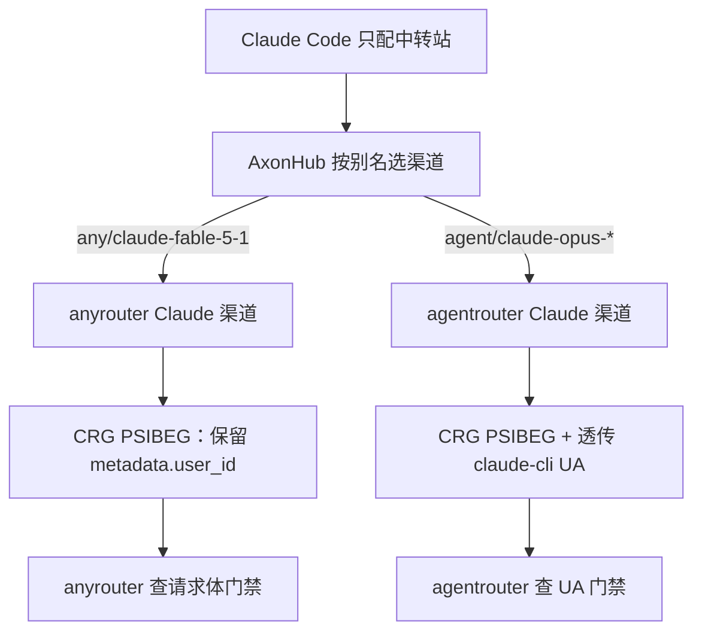
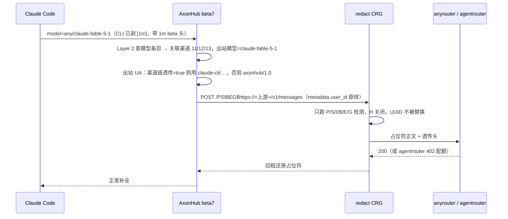
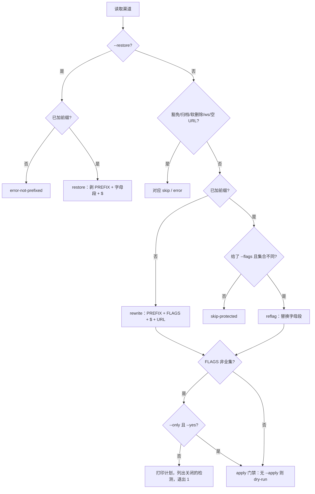

# 受限上游 Claude 经中转站使用 - Plan

## Goal Capsule

- **目标：** Claude Code 只配中转站 URL/Key，即可用 `any/claude-fable-5-1[1m]` 走 anyrouter、用 `agent/claude-opus-5[1m]` / `agent/claude-opus-4-8[1m]` 走 agentrouter，请求从新加坡 VPS 出站，客户端不挂 VPN。
- **推荐方案：** 别名落在 beta7 的「模型关联」层（新建三个模型条目，各自只关联指定渠道并映射到不带 `[1m]` 的上游真名）；五条 Claude 渠道的封套由现有渠道脚本改成 `PSIBEG$`（脚本新增 `--flags` 参数与 `reflag` 动作，并修复 restore 对带标志位封套的还原）；agentrouter 两条渠道开渠道级 User-Agent 透传；核对脚本列出每条受保护渠道的封套标志位；运维手册、验收记录、操作日志同步。不改 axonhub 代码与镜像，不改 vendored CRG，不改 `REDACT_ALLOWED_HOSTS`。
- **产品权威：** 中转站 owner（本对话确认人）。Product Contract 是 spec-brainstorm 产出的只读切片；本计划的范围与三项 HOW 取舍（别名走模型关联层、anyrouter 别名关联三条渠道、改标志位走脚本）已由 owner 在规划会话中确认。
- **决策焦点：** KTD-1 别名层级、KTD-2 脚本扩展与「削弱检测需显式确认」门禁、KTD-4 anyrouter 三渠道故障转移池、KTD-6 旧 `[1m]` 条目不动。
- **验证焦点：** 两份脚本的离线夹具测试；本地冒烟新增「`PSIBEG$` 保留 `metadata.user_id`、默认 `$` 会改写」对照用例；服务器上 AE1–AE7 由 owner 执行，证据写入 `deploy/privacy-redaction/ACCEPTANCE-RECORD.md`。
- **最大风险 / 边界：** 经 axonhub 完整链路（裸名 + `PSIBEG$`）打 anyrouter 尚未实测，此前的 200 是直接经 CRG 的探测；agentrouter 仍可能 402（上游配额，不算失败）。默认重试策略下一次彻底失败最多打 9 次上游，验收探测必须少而准。
- **停止条件：** 发现 axonhub 自身改写 `metadata.user_id`、CRG 标志位语义与 `worker.js` 不符、或裸名 + `PSIBEG$` 经 axonhub 打 anyrouter 仍 503 且原因超出本计划范围时，停止并回到 owner，不扩大探测。
- **执行画像与尾部归属：** U1–U4 由 `spec-work` 在本机完成（脚本、测试、文档）；U5–U6 由 owner 在服务器执行（改配置、验收、记录）。`spec-work` 交付时 U5/U6 状态为「交付 owner 执行」，并在交付说明中给出 runbook 第 11 节的入口。

---

## Product Contract

### Summary

给 anyrouter 与 agentrouter 的 Claude 渠道各配一条专用模型别名，让 Claude Code 用中转站的统一入口点名走哪家。这两家的 Claude 渠道继续经脱敏层出站，但关掉高熵检测以免改写 Claude Code 的 `metadata.user_id`；agentrouter 再打开 User-Agent 透传以通过其客户端门禁。裸名 `claude-fable-5-1` 与通用 opus 条目的现有关联本期不动。

### Problem Frame

owner 在国内用 Claude Code 时，anyrouter 与 agentrouter 都不允许「中转站那种转发」：直连它们要单独开窗口设 URL/Key，还要挂 VPN。中转站 VPS 在新加坡，本应消掉 VPN，但挂进中转站后 anyrouter 返回 503、agentrouter 返回 `401 unauthorized client detected`。对照实验表明两家门禁不同：anyrouter 看请求体是否像真实 Claude Code 会话，并把字面量 `[1m]` 模型名和被改写的 `metadata.user_id` 判为拒绝；agentrouter 只看 `User-Agent` 是否以 `claude-cli/` 开头。叠加的配置错误是：anyrouter 渠道把 `[1m]` 当上游模型名发出，脱敏层高熵检测改写了 session UUID，中转站默认把 UA 换成 `axonhub/1.0`。继续直连的代价是每次换模型都要改环境变量并挂 VPN；不修的代价是中转站上这两家 Claude 渠道持续失败，且失败会被默认策略连打多次。

### Key Decisions

- **脱敏冲突用封套标志位关掉高熵检测，不豁免、不改 CRG 代码。** anyrouter 与 agentrouter 的 Claude 渠道 Base URL 写成 `http://redact:8787/PSIBEG$https://<上游>`。密钥、手机、身份、银行、邮箱、gitleaks 检测仍开；无前缀的随机 token 在这几条渠道上不再被拦。信任边界核对仍把它们判为受保护。`(session-settled: user-directed — chosen over 完全豁免 and 给 CRG 打补丁跳过 metadata: 其余检测保留且不改 vendored CRG)`
- **用专用别名点名上游，不并入同名池。** Claude Code 用 `any/claude-fable-5-1[1m]` 走 anyrouter 三条渠道，用 `agent/claude-opus-5[1m]` 与 `agent/claude-opus-4-8[1m]` 走 agentrouter 两条渠道。客户端会剥掉 `[1m]` 并带上 1m beta 头；中转站把别名解析成上游真名（不含 `[1m]`）。`(session-settled: user-directed — chosen over 并入同名池 and 两者都要: 走哪家可控)`
- **agentrouter 额外打开 User-Agent 透传。** 它的门禁只认 `claude-cli/` 前缀；只关高熵检测不够。`(session-settled: user-directed — owner 确认「agentrouter 的 claude 也是一样的设置」，对照实验后落实为同一封套再加 UA 透传)`
- **本期不改 axonhub 代码与镜像。** 服务器跑官方 beta7；别名、UA 透传、请求头覆盖都是 beta7 已有渠道能力。原生处理 `[1m]` 后缀留给以后若升级自建镜像再做。

### Actors

- A1. 中转站 owner：在 Claude Code 里只配中转站 URL/Key，用 `/model` 选专用别名。
- A2. 中转站（AxonHub + 脱敏层）：按别名选渠道、剥掉别名前缀、经脱敏层转发。
- A3. anyrouter：要求请求体像真实 Claude Code 会话；模型名必须是列表中的裸名。
- A4. agentrouter（`ps.air-outer.com`）：要求 `User-Agent` 以 `claude-cli/` 开头；过门禁后仍受其额度限制。

### Key Flows

- F1. 选用 anyrouter fable
  - **Trigger:** owner 在已指向中转站的 Claude Code 里执行 `/model any/claude-fable-5-1[1m]` 并发一条消息。
  - **Actors:** A1, A2, A3
  - **Steps:** 客户端剥掉 `[1m]`，请求模型为 `any/claude-fable-5-1` 并带 1m beta 头；中转站只把该请求交给 anyrouter 三条 Claude 渠道，上游模型名为 `claude-fable-5-1`；脱敏层不改 `metadata.user_id`；anyrouter 返回正常补全。
  - **Covered by:** R1, R2, R3, R4, R6, R10

- F2. 选用 agentrouter opus
  - **Trigger:** owner 执行 `/model agent/claude-opus-5[1m]` 或 `/model agent/claude-opus-4-8[1m]`。
  - **Actors:** A1, A2, A4
  - **Steps:** 同上的别名解析与 `PSIBEG$` 封套；出站 `User-Agent` 保持客户端的 `claude-cli/…`；agentrouter 不再返回「unauthorized client」。若返回 402 额度耗尽，视为上游配额，不视为本期回归。
  - **Covered by:** R1, R2, R3, R4, R5, R6, R10

- F3. 脱敏层不可用
  - **Trigger:** `axonhub-redact` 停止期间，owner 对上述别名发请求。
  - **Actors:** A1, A2
  - **Steps:** 受保护渠道连不上脱敏层即失败，不把明文打到 anyrouter / agentrouter。行为沿用已验收的 fail-closed，本期不改策略。
  - **Covered by:** R7

### Requirements

**入口与别名**

- R1. owner 使用 anyrouter fable 与 agentrouter opus 时，Claude Code 只配中转站的 URL 与 API Key，不必再为这两家单独设环境变量或挂 VPN。
- R2. 中转站对客户端暴露且仅由对应上游承接的模型名为 `any/claude-fable-5-1`、`agent/claude-opus-5`、`agent/claude-opus-4-8`。Claude Code 里带 `[1m]` 后缀选用它们时，中转站收到的是剥掉后缀后的别名。
- R3. 发往 anyrouter / agentrouter 的模型名字面量不含 `[1m]`。anyrouter 三条 Claude 渠道只承接 fable 真名 `claude-fable-5-1`，避免 `any/` 前缀把该站没有的 opus 也暴露出去。

**出站形态**

- R4. anyrouter 与 agentrouter 的 Claude 渠道继续经脱敏层出站，封套为 `http://redact:8787/PSIBEG$https://<上游>`，从而关掉高熵检测、保留其余检测。`metadata.user_id` 中的 UUID 原样到达上游。
- R5. agentrouter 的 Claude 渠道打开 User-Agent 透传，使 Claude Code 的 `claude-cli/…` 到达上游。anyrouter 的 Claude 渠道不依赖 UA，不必为此改 UA 设置。
- R6. 上述渠道上，带常见前缀的密钥、手机号、身份与银行模式、邮箱、gitleaks 规则仍被替换为占位符；回程仍还原。本期不扩大也不缩小这六类检测的语义。
- R10. 在上游门禁与配额都满足时，上述别名的请求以正常补全结束，而不是 anyrouter 的 503/429「Service Unavailable」或 agentrouter 的 401「unauthorized client detected」。agentrouter 的 402 额度耗尽不算违反本条。

**运行手册与安全网**

- R7. 信任边界核对仍把这些渠道判为受保护，不把它们列入豁免或违规。`REDACT_ALLOWED_HOSTS` 不因本期改动而增删主机。
- R8. 回滚脚本遇到带标志位的封套时，必须还原成真正的上游 URL，而不是留下 `PSIBEG$https://…` 这种残段。runbook 第 9 节对这几条渠道在修脚本之前不可执行。
- R9. `deploy/privacy-redaction/README.md` 写明：哪些渠道用 `PSIBEG$`、为什么关高熵检测、agentrouter 为何还要 UA 透传、客户端如何用别名选用、回滚前必须用已修复的脚本。渠道 URL / 环境 / 脱敏变更仍按现有约定写入 `deploy/privacy-redaction/OPERATIONS-LOG.md`。

### Acceptance Examples

- AE1. **Covers R1, R2, R3, R4, R10.** Given Claude Code 只配中转站 URL/Key，When `/model any/claude-fable-5-1[1m]` 发一条短消息，Then 请求只打到 anyrouter 三条 Claude 渠道之一，上游模型名为 `claude-fable-5-1`，客户端收到正常补全，且本机无需 VPN。
- AE2. **Covers R3.** Given 中转站记录该次出站，When 查看发往 anyrouter 的请求体 `model` 字段，Then 其值是 `claude-fable-5-1` 而不是带 `[1m]` 的字面量。
- AE3. **Covers R4.** Given 同一条 Claude Code 请求经 `PSIBEG$` 封套，When 对比入站与出站的 `metadata.user_id`，Then `session_id` 仍是 UUID，没有被换成占位符。
- AE4. **Covers R5, F2.** Given agentrouter Claude 渠道已开 UA 透传，When Claude Code 用 `agent/claude-opus-5[1m]` 发请求，Then 上游不再返回 `unauthorized client detected`。402 额度耗尽视为通过门禁、未通过配额，不判 AE4 失败。
- AE5. **Covers R7.** Given 渠道 URL 已改为 `PSIBEG$`，When 跑现有信任边界核对，Then 这五条 Claude 渠道出现在受保护清单，豁免清单仍仅含官方 OpenAI 渠道，违规清单为空。
- AE6. **Covers R8.** Given 一条 `PSIBEG$` 渠道，When 用修复后的脚本对其执行 restore，Then Base URL 回到 `https://anyrouter.top` 或 `https://ps.air-outer.com` 这类真实上游，而不是 `PSIBEG$https://…`。
- AE7. **Covers R6.** Given anyrouter Claude 渠道走 `PSIBEG$`，When 用户消息里放一条带 `sk-` 前缀的假密钥，Then 上游看到占位符，客户端回程看到原值。

### Success Criteria

- owner 用中转站 URL/Key 完成 F1，无需为本期改 Claude Code 的全局环境变量。
- AE1–AE7 在服务器上留下请求记录或核对脚本输出，并写入验收记录。
- 其他受保护渠道的封套仍是默认 `$`（全开检测），不因本期被改成 `PSIBEG$`。

### Scope Boundaries

**本期包含**

- anyrouter Claude 渠道 11/12/13 与 agentrouter Claude 渠道 3/8 的封套、模型列表、别名关联、agentrouter 的 UA 透传。
- 回滚脚本对标志位封套的还原，以及 runbook / 操作日志中与此相关的说明。

**本期不包含**

- anyrouter GPT 渠道 14/15/16（近期失败是上游负载上限与超大请求体，与 Claude 门禁无关）。
- 给 axonhub 增加原生 `[1m]` 后缀处理。
- 把 `claude-opus-4-8` / `claude-opus-5` 通用条目从 anyrouter 关联上拆走或改指向（通用 opus 在 anyrouter 上本来就没有对应模型）。
- 把 `claude-fable-5-1` 裸名并入 anyrouter 池；该裸名继续只走现有 ccode 关联。
- agentrouter 的 402 额度；解锁门禁后若仍 402，去上游加配额，不作为本期缺陷。
- 升级或更换官方 axonhub 镜像。

### Dependencies / Assumptions

- 服务器保持 `looplj/axonhub:v1.0.0-beta7`。该版本已有 `ExtraModelPrefix`、渠道级 `PassThroughUserAgent`、请求头覆盖。
- 脱敏层继续是仓库内 vendored CRG；`PSIBEG` 是其已有标志位协议，不是新代码。
- anyrouter 的 Claude 门禁在规划期内仍以请求体为准，不改为查 UA。agentrouter 仍以 `claude-cli/` UA 为准。
- owner 的 anyrouter key 在 `/v1/models` 中仍只提供 `claude-fable-5-1`（2026-09-14 观测），不提供 opus-4-8 / opus-5。
- 对照探测已消耗 anyrouter 缓存 token；规划与验收应少打探测，避免被该站记为滥用。

### Outstanding Questions

**Resolve Before Planning**

无。

**Deferred to Planning**

- 这五条渠道要不要单独收紧重试次数。一次失败在默认策略下会打到多家渠道并各重试，anyrouter 会把拒绝也算进探测。
- 别名是用渠道 `ExtraModelPrefix` 实现，还是用模型映射表实现；以 beta7 已有能力为准，规划选定一种。
- `claude-fable-5-1[1m]` 等旧条目上指向 anyrouter 的关联是禁用还是保留（客户端不会发带 `[1m]` 的名字，但字面量若打到上游仍会失败）。

### Sources / Research

- `deploy/privacy-redaction/crg/worker.js`：`FLAG_NAMES` 中 `H` 为高熵检测；`parseProxyTarget` 解析 `/<flags>$<upstream>`；默认全开。`PSIBEG$` 关掉 H 后，本地回显证明 `metadata.user_id` 可保持原样。失效条件：升级 CRG 改变标志位字母或默认全开语义。
- `deploy/privacy-redaction/scripts/check-trust-boundary.sh`：受保护判定为 URL 以 `http://redact:8787/` 开头；`PSIBEG$` 仍满足。上游主机从 `$` 之后解析，标志位不进入主机名。
- `deploy/privacy-redaction/scripts/redact-channels.sh`：restore 对 `PREFIX` 之后只剥开头的 `$`，遇到 `PSIBEG$https://…` 会还原成错误残段。R8 由此而来。
- `internal/objects/channel.go`、`internal/server/biz/channel_llm.go`、`internal/server/orchestrator/pass_through.go`（beta7 与当前 fork 均有）：`ExtraModelPrefix` 把 `any/claude-fable-5-1` 解析为上游 `claude-fable-5-1`；`PassThroughUserAgent` 为 nil 时默认写成 `axonhub/1.0`。
- 线上观测（VPS `140.245.61.30`，2026-09-14/15）：渠道 11/12/13 指向 `anyrouter.top`，3/8 指向 `ps.air-outer.com`；入站请求 7202 为真实 Claude Code；经默认 `$` 封套转发 503；`PSIBEG$` + 裸名 fable 的端到端经 CRG 打 anyrouter 为 200。agentrouter 在 UA=`axonhub/1.0` 时 401，换成 `claude-cli/…` 后不再 401（当时为 402 额度）。anyrouter 公告页为混淆 JS，门禁规则由行为推断，不是公告原文。失效条件：任一家上游改门禁。

---

## Planning Contract

Product Contract unchanged (byte-preserved upstream source slice)

### Evidence & Limitations

线上运行 `looplj/axonhub:v1.0.0-beta7`（`docker inspect axonhub-app` 实测），本仓库 HEAD 为 `79fdf4b4`（分支 `unstable`）。所有 axonhub 侧结论读取 `v1.0.0-beta7` 标签处源码；`internal/server/biz/model_association_matcher.go` 在 beta7 与 HEAD 之间无差异，其余引用文件均按 beta7 版本核对。服务器侧事实来自 2026-09-15 对 `axonhub-postgres` 的只读查询。

| 核对项 | 结论 | 证据 |
| --- | --- | --- |
| beta7 路由顺序与「模型不存在时回退渠道」开关 | 先按请求模型名查 `models` 表（Layer 2）；查不到且开关为开时才回退到渠道级 `GetModelEntries()` 匹配（Layer 3）；条目存在但无可用关联时直接返回空候选，不回退。线上 `system_model_settings.fallback_to_channels_on_model_not_found=true` | `internal/server/orchestrator/candidates.go`（`Select`、`selectModelCandidates`、`selectChannelCadidates`）@ `v1.0.0-beta7`；`systems` 表 |
| `channel_model` 关联如何决定上游模型名 | 匹配器在指定渠道的 `GetModelEntries()` 里按 `modelId` 取条目，出站模型名为该条目的 `ActualModel`；渠道 `supported_models` 里的裸名条目 `ActualModel` 即裸名。关联指向渠道不再暴露的模型名时静默不匹配，不报错 | `internal/server/biz/model_association_matcher.go`（`matchChannelModel`）；`internal/server/biz/channel_llm.go`（`GetModelEntries`）@ beta7 |
| `updateChannel` 对 `settings` 的写入语义 | 整体覆盖（`mut.SetSettings(input.Settings)`），部分字段的 GraphQL 更新会清掉未传的字段（含渠道 11–13 现有的 `headerOverrideOperations`） | `internal/server/biz/channel.go`（`UpdateChannel`）@ beta7 |
| 出站 User-Agent 决策 | 渠道级 `passThroughUserAgent` 为 nil 时取全局 `system_user_agent_pass_through`（线上 `false`），关闭时写死 `axonhub/1.0`；渠道级 `true` 则透传客户端 UA | `internal/server/orchestrator/pass_through.go`（`applyUserAgentPassThrough`）@ beta7；`systems` 表 |
| 五条渠道实况 | 3、8：`http://redact:8787/$https://ps.air-outer.com`，模型 `["claude-opus-4-8","claude-opus-5"]`，`default_test_model=claude-opus-4-8`；11、12、13：`http://redact:8787/$https://anyrouter.top`，模型 `["claude-opus-4-8[1m]","claude-opus-5[1m]","claude-fable-5-1[1m]"]`，`default_test_model=claude-opus-5[1m]`，`headerOverrideOperations=[set anthropic-beta=context-1m-2025-08-07]`；五条均 `extraModelPrefix=""`、`modelMappings=[]`、`passThroughUserAgent` 未设、`endpoints=null`、`policies={"stream":"unlimited"}` | `channels` 表 |
| 模型条目实况 | `claude-opus-5`（id 2）关联渠道 3/8/18/17 与 11（`claude-opus-5[1m]`）；`claude-opus-4-8`（id 4）关联 11（`[1m]`，启用）与 3/8（已禁用）；`claude-opus-5[1m]`（id 5）关联 11/12/13 优先级 0/10/20；`claude-fable-5-1[1m]`（id 18）关联 11/12/13 优先级 0/1/2；`claude-fable-5-1`（id 19）只关联渠道 3；`claude-fable-5`（id 21）关联渠道 27 | `models` 表 |
| 真实 Claude Code 请求 7202 的入站与出站 | 入站模型 `claude-opus-4-8`（不带 `[1m]`），UA `claude-cli/2.1.270 (external, cli)`，`Anthropic-Beta` 含 `claude-code-20250219,context-1m-2025-08-07,interleaved-thinking-2025-05-14,…`，`metadata.user_id` 含 64 位十六进制 `device_id` 与 UUID `session_id`。三次出站都在渠道 11，模型字面量 `claude-opus-4-8[1m]`，UA `axonhub/1.0`，`Anthropic-Beta` 仅 `context-1m-2025-08-07`，`metadata.user_id` 与入站一致（脱敏前），全部 503 | `requests`、`request_executions` 表 |
| 重试策略 | `systems` 表无 `retry_policy` 行，取默认：最多 3 条渠道、单渠道重试 2 次（即每渠道 3 次尝试）、间隔 1000ms、`adaptive`；beta7 渠道级只有追加式 `retryableStatusCodes` / `retryableErrorPatterns` 与自动禁用规则，模型级只有负载均衡策略与粘性模式，都不能减少重试次数 | `internal/server/biz/system_default.go`、`internal/objects/channel.go`、`internal/objects/model.go` @ beta7 |
| 渠道脚本对标志位封套的处理 | restore 只剥 `PREFIX` 后开头的 `$`，`PSIBEG$https://…` 会残留；rewrite 固定写 `$`（全开），没有设置标志位的入口；已加前缀的 URL 不论标志位都判 `skip-protected`（幂等）；apply 循环只消费 `newBase` / `newEps`，与动作名无关 | `deploy/privacy-redaction/scripts/redact-channels.sh` |
| 核对脚本对标志位封套的处理 | 受保护判定为 URL 以 `http://redact:8787/` 开头；上游主机从第一个 `$` 之后解析，标志位不进入主机名；不校验标志位字母是否合法 | `deploy/privacy-redaction/scripts/check-trust-boundary.sh` |
| CRG 标志位语义 | `FLAG_NAMES`：`H` 高熵、`P` 手机、`S` 密钥、`I` 身份、`B` 银行、`E` 邮箱、`G` gitleaks；`parseProxyTarget` 取路径开头到第一个 `$` 之间的字母为标志位，空段等价全开，未知字母 400 | `deploy/privacy-redaction/crg/worker.js` |

补充事实与限制：

- 工作树不干净：`deploy/privacy-redaction/` 下 `README.md`、`OPERATIONS-LOG.md`、`scripts/smoke-local.sh`、`crg/Dockerfile`、`crg/UPSTREAM.md`、`.env.example` 有未提交修改，`crg/entry.mjs`、`crg/media-extract.mjs`、`tests/media-extract.test.mjs` 未跟踪。这是 2026-09-15 已部署到服务器的「parse 前剥离超大媒体」封装，与本计划无关。本计划的 U3、U4 会在其中三个文件上叠加修改，不回退、不整理这些改动；提交顺序见 Open Questions OQ-1。
- Product Contract 与实况的两处出入，均不在本期范围、不改动：裸名 `claude-fable-5-1` 的现有关联指向渠道 3（agentrouter），不是 ccode（渠道 27 关联的是 `claude-fable-5`）；渠道 11–13 的 `anthropic-beta` 头覆盖是 `set`，会把客户端整条 beta 列表替换成只剩 `context-1m-2025-08-07`。两者已列入 Deferred to Follow-Up Work。
- 直接经 CRG 以 `PSIBEG$` + 裸名打 anyrouter 得到 200 的观测来自 origin，不经 axonhub；经 axonhub 完整链路的结果只能在 U6 得到。
- `models.model_id` 是无格式约束的字符串字段，`GetModelByModelID` 精确匹配；控制台新建模型表单是否接受含 `/` 的模型 ID 未验证，U5 提供 GraphQL `createModel` 作为备用路径。
- 无外部检索：上游门禁规则只能靠实况观察且已在 origin 记录；仓库内脚本、测试、runbook 模式充足。

### Key Technical Decisions

- **KTD-1 别名落在「模型关联」层，不用渠道级前缀或映射。** 新建三个模型条目 `any/claude-fable-5-1`、`agent/claude-opus-5`、`agent/claude-opus-4-8`（developer `anthropic`，类型 chat），各自只用 `channel_model` 关联到指定渠道，关联的渠道模型名是裸名真名，出站即裸名。anyrouter 三条渠道的 `supported_models` 收窄为 `["claude-fable-5-1"]`，`default_test_model` 同步改为 `claude-fable-5-1`；agentrouter 两条渠道的模型列表不变。理由：Layer 2 先于渠道匹配，候选集与优先级由条目精确控制，满足 R2「仅由对应上游承接」；不依赖全局回退开关；与站内其余 Claude 条目的配置方式一致。放弃：`extraModelPrefix`（把渠道全部模型挂上前缀、依赖回退开关、无优先级）、`modelMappings`（仍在 Layer 3，依赖回退开关）。`(session-settled: user-approved — chosen over 渠道额外模型前缀 / 模型映射表: 候选集精确、不依赖全局回退开关)`
- **KTD-2 封套标志位变更与回滚都走 `deploy/privacy-redaction/scripts/redact-channels.sh`，架构姿态 `extend`。** 脚本新增 `--flags <LETTERS>`：字母必须是 `HPSIBEG` 的子集且不重复，按 `HPSIBEG` 顺序规范化，全集规范化为空段（写成 `$`，与现状一致）；rewrite 用该段生成封套 `PREFIX + FLAGS + "$" + URL`；已受保护渠道的当前段与请求段（按集合比较）不同时产生新动作 `reflag`，相同则仍 `skip-protected`。restore 改为剥掉 `PREFIX` 后「零个或多个大写字母加 `$`」的整段，端点 URL 同样处理。门禁：`--flags` 非全集（削弱检测）时必须同时给 `--only` 与 `--yes`，计划输出列出被关闭的检测名并提示记录 BR-005；`--flags` 与 `--restore` 互斥。apply 循环沿用现有 `newBase` / `newEps` 写回，不新增写路径。理由：脚本已是渠道 URL 封套的唯一权威写入口，离线可出计划、幂等可重跑、留审计痕迹；R8 的修复本就落在这里。放弃：控制台手改五条 Base URL（无计划/审计/幂等，且 restore 仍要修）。`(session-settled: user-approved — chosen over 控制台手改: 可离线出计划、幂等、留审计痕迹)`
- **KTD-3 渠道模型列表、默认测试模型、UA 透传、模型条目由 owner 在控制台操作，脚本不扩展到 `settings`。** `updateChannel` 的 `settings` 是整体覆盖，控制台表单提交完整对象最安全；模型列表与模型条目本就是控制台工作流。每一步 runbook 都配 `psql` 只读核验语句，特别核验渠道 11–13 的 `headerOverrideOperations` 未丢。GraphQL 片段只作为控制台不可用时的备用路径写在 runbook 里。
- **KTD-4 anyrouter 别名关联三条渠道做故障转移池，agentrouter 别名关联两条；不改全局重试策略。** `any/claude-fable-5-1` 关联渠道 11/12/13，优先级 0/10/20（沿用 id 5 的写法）；`agent/claude-opus-5` 与 `agent/claude-opus-4-8` 关联渠道 3/8，优先级 0/10。代价：默认策略下一次彻底失败最多 3 渠道 × 3 次 = 9 次上游调用，anyrouter 会把拒绝计入探测。beta7 没有渠道级或模型级的重试次数设置，收紧只能改全局（影响全部渠道），留给 owner 决定（OQ-2）。`(session-settled: user-approved — chosen over 只关联一条 anyrouter 渠道: 保留故障转移，接受失败时的探测足迹)`
- **KTD-5 `deploy/privacy-redaction/scripts/check-trust-boundary.sh` 增加封套标志位列表与非法字母判定，架构姿态 `extend`。** 对每条受保护 URL 解析 `PREFIX` 与第一个 `$` 之间的段：字母不在 `HPSIBEG` 内判违规（退出码 1，CRG 运行时会 400）；非空段的渠道进入新增的「降级封套」清单，写明关闭了哪些检测。退出码语义不变：降级只是信息，违规与漂移仍非零。这直接支撑 AE5 与「其他受保护渠道仍是 `$`」的成功标准。
- **KTD-6 旧 `[1m]` 模型条目与关联全部不动。** 渠道 11–13 去掉 `[1m]` 字面量后，id 2、4、5、18 里指向这些字面量的关联自然不再匹配（静默、无错误）；id 5 与 id 18 变成无候选条目，客户端不会请求这些名字。理由：Scope Boundaries 明确不拆通用 opus 条目；显式禁用不改变任何可观测行为却扩大改动面。
- **KTD-7 验证证据分层。** 机制层在本地回显证明：`PSIBEG$` 下 `metadata.user_id` 原样到达上游而默认 `$` 会改写（AE3 形状），密钥仍被替换（AE7 形状）。服务器层用行为证据加数据库出站记录：`request_executions.request_body->>'model'` 证明模型字面量（AE2），`request_headers` 证明出站 UA（AE4），`metadata` 只能证明脱敏前的值；上游是否收到原样 UUID 以 anyrouter 返回 200 为准，因为 CRG 不记录正文。
- **KTD-8 文档落位。** `deploy/privacy-redaction/README.md` 新增第 11 节承载 R9 的全部内容，§7 SOP 与 §9 回滚各补一段引用，「已知边界」补一条；`ACCEPTANCE-RECORD.md` 新增本期 AE 表由 owner 填写；`OPERATIONS-LOG.md` 只补表头动作说明（`reflag`、`config-change`），记录行由 owner 在执行时追加。冒烟脚本新增段落编号为「3b」，不重排未提交改动里的既有编号。

### Interface Contracts

| 字段 | 内容 |
| --- | --- |
| 接口 / 模式 | `redact-channels.sh` 命令行契约，`evolution` |
| 消费者 | owner 手工执行；`tests/redact-channels.test.sh`；runbook §4、§5、§7、§9、§11 |
| 权威产物 | `deploy/privacy-redaction/scripts/redact-channels.sh`（含 `usage()` 帮助文本），owner 为 U1 |
| 契约摘要 | 新增选项 `--flags <LETTERS>`；新增动作 `reflag`；`--flags` 非全集要求 `--only` 与 `--yes`，否则打印计划后退出码 1；`--flags` 与 `--restore` 同用退出码 2；`--flags` 字母非法退出码 2；restore 对 `PREFIX<字母>$<URL>` 还原为 `<URL>` |
| 兼容性 | 加法变更：不给 `--flags` 时 rewrite、skip、error 行为与输出逐字不变；restore 对无标志位封套的结果不变；退出码含义不变 |
| 验证 | `bash deploy/privacy-redaction/tests/redact-channels.test.sh`（既有 11 组全部保持通过，新增第 12 组） |

### High-Level Technical Design

目标终态（配置层，不改代码）：

| 对象 | 现状 | 终态 |
| --- | --- | --- |
| 渠道 11/12/13 Base URL | `http://redact:8787/$https://anyrouter.top` | `http://redact:8787/PSIBEG$https://anyrouter.top` |
| 渠道 3/8 Base URL | `http://redact:8787/$https://ps.air-outer.com` | `http://redact:8787/PSIBEG$https://ps.air-outer.com` |
| 渠道 11/12/13 `supported_models` / `default_test_model` | 三个 `[1m]` 字面量 / `claude-opus-5[1m]` | `["claude-fable-5-1"]` / `claude-fable-5-1` |
| 渠道 3/8 `settings.passThroughUserAgent` | 未设（继承全局 false） | `true` |
| 渠道 11/12/13 `settings.headerOverrideOperations` | `set anthropic-beta=context-1m-2025-08-07` | 不变 |
| 模型条目 `any/claude-fable-5-1` | 不存在 | `channel_model` → 渠道 11 `claude-fable-5-1` p0、12 p10、13 p20 |
| 模型条目 `agent/claude-opus-5` | 不存在 | `channel_model` → 渠道 3 `claude-opus-5` p0、8 p10 |
| 模型条目 `agent/claude-opus-4-8` | 不存在 | `channel_model` → 渠道 3 `claude-opus-4-8` p0、8 p10 |
| 其余受保护渠道封套、`REDACT_ALLOWED_HOSTS`、全局设置 | — | 不变 |

请求链路（F1 / F2 的技术形态）：

渠道脚本的动作判定（U1 扩展后）：

### Implementation Scope Boundaries

- 不修改 `deploy/privacy-redaction/crg/` 下任何文件（含未提交的 `entry.mjs`、`media-extract.mjs`）、`docker-compose.redaction.yml`、`.env.example`、`REDACT_ALLOWED_HOSTS`。
- 不修改 axonhub 的 Go / 前端代码，不升级镜像，不改全局系统设置（UA 透传、重试策略、模型设置）。
- 不编辑模型条目 id 2、4、5、18、19、21 及其关联；不碰 anyrouter GPT 渠道 14/15/16。
- 渠道脚本不扩展到 `settings`、`supportedModels` 的写入。
- 服务器上的每一步变更都是 owner 执行；`spec-work` 不接触 VPS。

### Deferred to Follow-Up Work

- 收紧失败时的探测足迹：需要 axonhub 提供渠道级或模型级重试次数，或 owner 调低全局单渠道重试（OQ-2）。
- 渠道 11–13 的 `anthropic-beta` 头覆盖由 `set` 改为合并客户端列表（现状会丢掉 `claude-code-20250219`、`interleaved-thinking-2025-05-14`）。
- 裸名 `claude-fable-5-1` 条目（id 19）当前只关联到不提供该模型的渠道 3，属既有不可路由状态，由 owner 另行处理。
- 给 axonhub 增加原生 `[1m]` 后缀处理（Product Contract 已排除）。
- 核对脚本接入 cron 后的通知渠道（沿自上一份计划）。

### Open Questions

- OQ-1（deferred，owner）：媒体剥离封装的未提交改动与本计划改动同处一个目录。建议 owner 先把媒体剥离改动单独提交，`spec-work` 再在其上开工；若 owner 选择合并提交，`spec-work` 须在提交说明里分开列出两组改动。不阻塞规划与实现。
- OQ-2（deferred，owner）：是否把全局「单渠道重试次数」从 2 调低。这是影响全部渠道的运维决策，本计划按现状规划；owner 在 U6 观察到探测量过大时再决定。

### System-Wide Impact

- 服务端配置（渠道 3/8/11/12/13、三个新模型条目）：`in-scope`，全部为控制台或脚本写入，无 schema 变更。
- 脱敏层运行时：`in-scope` 仅限五条渠道的封套路径；容器、环境变量、vendored 代码不变。
- 运维脚本与离线测试：`in-scope`（U1、U2、U3）。
- 运维手册、验收记录、操作日志：`in-scope`（U4、U5、U6）。
- 客户端（Claude Code）：`out-of-scope: 只用 /model 选别名，不改任何客户端配置`。
- axonhub 源码、镜像、全局系统设置：`out-of-scope: Product Contract 排除`。
- 数据：`out-of-scope: 本机 Postgres 明文存档为既有边界，本期不动`。

### Risks & Dependencies

- **经 axonhub 完整链路仍被 anyrouter 拒绝。** 缓解：U6 先发一条最短消息，失败即读取该次 `request_executions` 的出站正文与头，对照 origin 记录的门禁特征，停止并回到 owner；不循环探测。
- **失败时的探测足迹。** 三渠道池 × 每渠道 3 次尝试；owner 已接受（KTD-4），OQ-2 保留调低全局重试的选项。验收探测总量控制在每个别名 1–2 条消息。
- **控制台编辑 `settings` 误删字段。** 缓解：U5 每步后用 `psql` 核验 `headerOverrideOperations`、`passThroughUserAgent`、`supported_models` 的落盘值；发现丢失立即在控制台补回并记录。
- **控制台拒绝含 `/` 的模型 ID。** 缓解：runbook 给出 GraphQL `createModel` 备用路径；`models.model_id` 无格式约束。
- **Claude Code 未来不再剥 `[1m]`。** 请求会以字面量到达，查不到条目、回退渠道也无匹配，客户端收到错误而不是打到上游；届时需要新增字面量条目或启用原生处理（已列 Deferred）。
- **自动禁用。** beta7 默认关闭自动禁用，上一期验收记录 `auto_disabled_at` 全程为空；本期不引入新状态码，风险低。
- **回滚路径。** 封套回全开：`--only 3,8,11,12,13 --flags HPSIBEG --apply`（加强检测，无需 `--yes`）；恢复直连：修复后的 `--restore`；别名回退：禁用或删除三个模型条目；UA 回退：控制台关闭。每一步都记 `OPERATIONS-LOG.md`。
- **依赖。** 服务器保持 beta7；CRG 标志位协议不变；owner 的 anyrouter key 仍提供 `claude-fable-5-1`；agentrouter 门禁仍只看 UA。

### Alternatives Considered

- **渠道 `extraModelPrefix`。** 一个字段即可，但会把渠道内全部模型挂上前缀、依赖 `fallback_to_channels_on_model_not_found`、无优先级；被 KTD-1 否决。
- **渠道 `modelMappings`。** 按别名逐条映射，暴露面可控，但仍在 Layer 3 且依赖回退开关；被 KTD-1 否决。
- **控制台手改五条 Base URL，脚本只修 restore。** 改动面最小，但无离线计划、无幂等、无审计痕迹，且「其他渠道仍是 `$`」无法用脚本证明；被 KTD-2 否决。
- **只关联一条 anyrouter 渠道。** 探测足迹最小，但失去故障转移；owner 选择三渠道池（KTD-4）。
- **完全豁免 / 给 CRG 打补丁跳过 `metadata`。** Product Contract 已否决，本计划不再讨论。

---

## Implementation Units

依赖顺序：U1 → U2；U3 不依赖其他单元，可与 U1、U2 并行；U4 依赖 U1–U3；U5、U6 依次在 U4 之后。U1–U4 由 `spec-work` 完成，U5、U6 由 owner 在服务器执行。

### U1. 渠道脚本：标志位参数、reflag 动作与 restore 修复

- **Goal**：让 `redact-channels.sh` 能把指定渠道的封套改成带标志位的形态、能把带标志位的封套正确还原，并在削弱检测时强制显式确认。
- **Requirements**：R4、R8；AE6；F1、F2 的出站形态前提。
- **Dependencies**：无。
- **Files**：`deploy/privacy-redaction/scripts/redact-channels.sh`、`deploy/privacy-redaction/tests/redact-channels.test.sh`、`deploy/privacy-redaction/tests/fixtures/channels-flagged.json`（新增）。
- **Approach**：按 KTD-2 实现。解析层新增 `--flags`，校验字母集合并规范化为 `HPSIBEG` 顺序，全集归一为空段；把规范化结果经 `NODE_ENV_KEYS` 传入计划层。计划层：`wrap()` 改为拼接标志位段；已受保护分支比较当前段与请求段的集合，不同则产出 `reflag` 动作（`oldBase`、`newBase`、`newEps` 同 rewrite 形状）；restore 分支剥掉 `PREFIX` 后匹配「大写字母零个或多个加 `$`」的整段，端点同样处理。执行门禁：在现有 `--restore` 无 `--yes` 的门禁旁增加「`FLAGS` 非全集且缺 `--only` 或 `--yes`」的阻塞，退出码 1，消息列出关闭的检测名（按 `FLAG_NAMES` 的中文名）并提示 BR-005；`--flags` 与 `--restore` 同用为用法错误。人类可读计划的分组顺序加入 `reflag`；`usage()` 补选项与动作说明。apply 循环不改。
- **Execution note**：先在测试脚本里写出带标志位封套的 restore 与 reflag 期望（离线 `--plan-from-file`），再改脚本；每一步都确认既有 11 组用例仍通过。
- **Patterns to follow**：脚本内现有的 `--restore` 门禁与消息写法；`js_module` 计划层的 `add()` / `actions` 形状；测试脚本的 `run` / `has` / `hasnt` 与 `fx()` 内联夹具。
- **Test scenarios**：
  - Covers AE6. `--restore 11` 对 `http://redact:8787/PSIBEG$https://anyrouter.top` → 计划行以 `->  https://anyrouter.top` 结尾，输出不含 `PSIBEG$`。
  - 带标志位的端点 URL 在 restore 时同样还原为真实上游。
  - `--restore` 对无标志位封套 `http://redact:8787/$https://third.example/v1` 的结果与现有第 8 组期望逐字相同。
  - `--flags PSIBEG --only 10 --yes` 对未受保护渠道 → `rewrite (1)`，新值为 `http://redact:8787/PSIBEG$https://third.example/v1`。
  - `--flags PSIBEG --only 12 --yes` 对 `http://redact:8787/$https://third.example` → `reflag (1)`，计划行显示旧值到新值，`待写 1 条`。
  - `--flags PSIBEG --only 12 --yes` 对已是 `PSIBEG$` 的渠道 → `skip-protected`，`待写 0 条`。
  - `--flags SPIBEG`（顺序不同）对已是 `PSIBEG$` 的渠道 → `skip-protected`（集合相等）。
  - `--flags HPSIBEG --only 12`（全集）对 `PSIBEG$` 渠道 → `reflag (1)` 且新值为 `http://redact:8787/$https://third.example`，不需要 `--yes`。
  - `--flags PSIBEG --only 12`（缺 `--yes`）→ 打印计划后退出码 1，输出含「H」对应的检测名与 `BR-005`。
  - `--flags PSIBEG --yes`（缺 `--only`）→ 退出码 1，输出提示需要 `--only`。
  - `--flags XYZ` 与 `--flags psibeg` → 退出码 2，输出指出非法字母。
  - `--flags PSIBEG --restore 12` → 退出码 2，输出指出互斥。
  - `--help` 输出含 `--flags` 与 `reflag`。
  - 既有第 1–11 组用例全部保持通过。
- **Verification**：测试脚本汇总 `FAIL 0`；不带 `--flags` 时对既有夹具的计划输出与改动前逐字一致（可用改动前脚本的输出快照比对）。

### U2. 核对脚本：封套标志位列表与非法字母判定

- **Goal**：让 `check-trust-boundary.sh` 显示每条受保护渠道关闭了哪些检测，并把非法标志位判为违规，使 AE5 与「其余渠道仍是 `$`」可用脚本证明。
- **Requirements**：R7；AE5；Success Criteria 第三条。
- **Dependencies**：U1（共用夹具 `channels-flagged.json`）。
- **Files**：`deploy/privacy-redaction/scripts/check-trust-boundary.sh`、`deploy/privacy-redaction/tests/check-trust-boundary.test.sh`、`deploy/privacy-redaction/tests/fixtures/channels-flagged.json`。
- **Approach**：按 KTD-5 实现。在判定层的受保护分支里，对每条 URL 取 `PREFIX` 之后到第一个 `$` 之间的段：含 `HPSIBEG` 之外的字符 → 违规，理由写明该段；非空且合法 → 记入该渠道的降级信息（关闭的检测 = 全集减该段，按 `FLAG_NAMES` 中文名输出）。输出在「受保护渠道」之后新增「降级封套 (N)」段，每行 `#id name  <段>（关闭: …）`，N 为 0 时打印 `(空)`。允许主机集合推导、豁免判定、退出码规则不变。
- **Patterns to follow**：脚本内 `protectedList` / `notes` 的收集与输出写法；测试脚本的 `write_fixture` 内联夹具与 `has` / `hasnt`。
- **Test scenarios**：
  - Covers AE5. 夹具含两条 `PSIBEG$` 渠道、一条 `$` 渠道、豁免 #26 → 退出码 0，「受保护渠道 (3)」，「降级封套 (2)」列出两条并注明关闭高熵检测，豁免清单仅 #26，允许主机集合与夹具一致。
  - 现有合规夹具 → 「降级封套 (0)」，其余输出与现有第 1 组期望一致。
  - `http://redact:8787/XYZ$https://a.example` → 违规清单含该渠道，理由含 `XYZ`，退出码 1。
  - 端点 URL 带 `PSIBEG$` 而 base 为 `$` → 仍受保护，降级信息按 URL 逐条列出。
  - `--skip-host-check` 下降级列表仍输出。
  - 既有违规集、单项违规、软删除等用例全部保持通过。
- **Verification**：测试脚本汇总 `FAIL 0`；对现有 `channels-compliant.json` 的输出除新增「降级封套 (0)」段外逐字不变。

### U3. 本地冒烟：标志位封套对照用例

- **Goal**：在本地回显链路上证明 `PSIBEG$` 保留 `metadata.user_id` 而默认 `$` 会改写，且 `PSIBEG$` 下密钥仍被替换。
- **Requirements**：R4、R6；AE3、AE7 的机制层证据。
- **Dependencies**：无（可与 U2 并行）。
- **Files**：`deploy/privacy-redaction/scripts/smoke-local.sh`。
- **Approach**：在第 3 段（AE-01）之后新增「3b. 标志位封套对照」。构造一个 Anthropic 形状的请求体：`metadata.user_id` 为 JSON 字符串，内含 64 位十六进制 `device_id` 与 UUID `session_id`（形状对齐请求 7202），文本里放 `FAKE_KEY`。先打 `/PSIBEG$http://echo:8080/v1/messages`：回显里 `device_id` 与 `session_id` 原样出现、`FAKE_KEY` 不出现；再打 `/$http://echo:8080/v1/messages`：回显里的 `user_id` 与原值不同且含 `{{Redact:` 占位符。两次都要 200 且回显行数递增。段落标号「3b」，不重排既有编号。
- **Execution note**：这是运行时冒烟，不写单元测试；本机无 docker 时按 Verification Contract 记为 `deferred` 并在交付说明里写明。
- **Patterns to follow**：第 3 段的 `in_net_node` 请求模板、`echo_log_lines` / `echo_log_raw` 比对、`c_pass` / `c_fail` 断言。
- **Test scenarios**：
  - Covers AE3. `PSIBEG$` 请求的回显含原样 UUID 与 64 位十六进制串。
  - Covers AE7. 同一请求的回显不含 `FAKE_KEY`，且含至少一个占位符。
  - 默认 `$` 请求的回显中 `user_id` 含 `{{Redact:`，证明高熵检测是改写来源。
  - 两次请求状态码都是 200。
- **Verification**：`bash deploy/privacy-redaction/scripts/smoke-local.sh` 退出码 0，新增四项断言全部 PASS，既有断言不受影响。

### U4. 运维手册、验收记录与操作日志模板

- **Goal**：把本期做法与 owner 要执行的每一步写进 runbook，准备验收记录表与操作日志的动作说明。
- **Requirements**：R9；Success Criteria 第二条；为 U5、U6 提供操作依据。
- **Dependencies**：U1、U2、U3（命令与输出形状以实现为准）。
- **Files**：`deploy/privacy-redaction/README.md`、`deploy/privacy-redaction/ACCEPTANCE-RECORD.md`、`deploy/privacy-redaction/OPERATIONS-LOG.md`。
- **Approach**：按 KTD-3、KTD-8 编写。README 新增「## 11. 受限上游：标志位封套与专用别名」，子节：11.1 适用渠道与原因（哪些渠道用 `PSIBEG$`、为什么关高熵检测、agentrouter 为什么还要 UA 透传、anyrouter 门禁看请求体）；11.2 改标志位（`--only 3,8,11,12,13 --flags PSIBEG` 先 dry-run 再 `--yes --apply`，期望 `reflag (5)`）；11.3 渠道 11–13 模型列表与默认测试模型（控制台步骤 + `psql` 核验语句）；11.4 渠道 3/8 UA 透传（控制台步骤 + `psql` 核验 `passThroughUserAgent` 与 11–13 的 `headerOverrideOperations` 完整性）；11.5 三个模型条目（控制台「模型管理 → 新建 → 关联：指定渠道模型」步骤、优先级、GraphQL `createModel` 备用片段、`psql` 核验）；11.6 客户端用法（`/model any/claude-fable-5-1[1m]` 等，说明 CLI 剥 `[1m]` 并带 1m beta 头）；11.7 验收（AE1–AE7 的操作、`psql` 查询与判据，agentrouter 402 的口径）；11.8 回滚（顺序、命令、必须用修复后的脚本）。目录、§7 SOP 补「按渠道改标志位」入口、§9 补「带标志位封套的 restore 已支持」、「已知边界」补「`PSIBEG$` 渠道不拦无前缀随机 token」。ACCEPTANCE-RECORD 新增「## 受限上游别名（2026-09）」表（AE1–AE7，结论初值 `未执行`，列：AE、需求、结论、日期、证据位置、备注）。OPERATIONS-LOG 表头动作说明补 `reflag`（改封套标志位）与 `config-change`（渠道模型列表 / UA / 模型条目），不追加记录行。
- **Execution note**：文档工作；验证方式是对照实现的实际命令与输出复核，而不是单元测试。
- **Patterns to follow**：README §4、§5 的「先看计划 → 执行 → 立刻记录 → 核验」节奏与 `psql` / `curl` 片段写法；ACCEPTANCE-RECORD 的表格列。
- **Test scenarios**：Test expectation: none -- 纯文档单元。复核清单：11.2 的命令与 U1 的门禁一致；11.7 的每条 AE 都有可执行的查询或操作；表格能被现有 markdown 渲染；`git grep` 泄露扫描无命中。
- **Verification**：README 目录含第 11 节且各子节齐全；ACCEPTANCE-RECORD 表含 AE1–AE7；OPERATIONS-LOG 表头含两个新动作；泄露扫描无命中。

### U5. 服务器变更（owner 执行）

- **Goal**：把五条渠道、三个模型条目改到 High-Level Technical Design 的终态，并留下操作记录。
- **Requirements**：R2、R3、R4、R5、R7；F1、F2、F3 的前提。
- **Dependencies**：U1–U4 已完成并同步到服务器。
- **Files**：服务器配置（不在仓库）；`deploy/privacy-redaction/OPERATIONS-LOG.md`（owner 追加记录行）。
- **Approach**：按 README 第 11 节顺序执行：同步脚本 → 11.2 改标志位（dry-run 看到 `reflag (5)` 后 `--yes --apply`）→ 跑核对脚本确认降级封套恰为五条、违规空、主机集合一致 → 11.3 渠道 11–13 模型列表与默认测试模型 → 11.4 渠道 3/8 UA 透传 → 11.5 三个模型条目 → 每步 `psql` 核验 → 每步一行 `OPERATIONS-LOG.md`。任一步核验不符即停在该步，不继续。
- **Execution note**：先 dry-run 再 apply；所有写操作只经脚本或控制台，不直改数据库。
- **Patterns to follow**：README §4、§5 的灰度节奏；BR-005 的记录约定。
- **Test scenarios**：
  - Covers AE5. 核对脚本：受保护清单含 3/8/11/12/13，降级封套恰为这五条且都是 `PSIBEG`，豁免仅 #26，违规空，允许主机集合一致。
  - `psql`：五条 `base_url` 以 `http://redact:8787/PSIBEG$` 开头；渠道 11–13 `supported_models=["claude-fable-5-1"]`、`default_test_model=claude-fable-5-1`、`headerOverrideOperations` 仍含 anthropic-beta 覆盖；渠道 3/8 `settings->>'passThroughUserAgent'='true'`。
  - `psql`：三个模型条目存在、状态 enabled、关联恰为终态表所列。
  - 其余受保护渠道 `base_url` 仍为 `http://redact:8787/$…`。
- **Verification**：以上核验全部成立；`OPERATIONS-LOG.md` 有 `reflag` 与 `config-change` 记录行。

### U6. 验收与记录（owner 执行）

- **Goal**：在服务器上取得 AE1–AE7 的证据并写入验收记录。
- **Requirements**：R1、R2、R3、R4、R5、R6、R10；AE1–AE7；F1、F2。
- **Dependencies**：U5。
- **Files**：`deploy/privacy-redaction/ACCEPTANCE-RECORD.md`（owner 填写）；`deploy/privacy-redaction/OPERATIONS-LOG.md`（如有变更）。
- **Approach**：按 README 11.7 执行，探测总量每个别名 1–2 条消息。AE1：Claude Code 只配中转站，`/model any/claude-fable-5-1[1m]` 发一条短消息得到正常补全；`psql` 查该请求的 `request_executions` 恰一条、`channel_id` ∈ {11,12,13}、状态成功。AE2：同一执行的 `request_body->>'model'` 为 `claude-fable-5-1`。AE3：执行记录的 `metadata.user_id` 与入站一致，且上游返回 200；机制层证据引用 U3 的冒烟结果。AE4：`/model agent/claude-opus-5[1m]` 发一条消息，执行记录 `request_headers` 的 User-Agent 以 `claude-cli/` 开头，上游不返回 401；402 记为「通过门禁、配额不足」。AE5：引用 U5 的核对脚本输出。AE6：对渠道 11 跑 `--restore 11` dry-run，计划行还原为 `https://anyrouter.top`，不加 `--apply`。AE7：经 anyrouter 别名发一条含假 `sk-` 密钥并要求复述的消息，客户端收到原值，模型回复显示看到的是占位符。失败处理：AE1 失败即按 Goal Capsule 停止条件处理，把该执行的出站正文特征写入记录。
- **Execution note**：行为验证；每条 AE 的证据位置写请求 id 或脚本输出所在位置。
- **Patterns to follow**：ACCEPTANCE-RECORD 既有 AE-02 / AE-04 / AE-11 的证据写法。
- **Test scenarios**：
  - Covers F1 / AE1、AE2、AE3。
  - Covers F2 / AE4。
  - Covers AE5、AE6、AE7。
  - 反向：`/model claude-fable-5-1[1m]`（旧名）不打到 anyrouter（可选，不必执行，只在记录里说明原因）。
- **Verification**：ACCEPTANCE-RECORD 新表 AE1–AE7 全部有结论且 AE1、AE2、AE4、AE5、AE6 为通过，AE3、AE7 至少机制层通过；`OPERATIONS-LOG.md` 记录完整。

---

## Verification Contract

| 检查 | 命令 / 方式 | 适用单元 | 通过信号 |
| --- | --- | --- | --- |
| 改写脚本单测 | `bash deploy/privacy-redaction/tests/redact-channels.test.sh` | U1 | 汇总 `FAIL 0`；既有 11 组保持通过，新增第 12 组通过 |
| 核对脚本单测 | `bash deploy/privacy-redaction/tests/check-trust-boundary.test.sh` | U2 | 汇总 `FAIL 0` |
| 本地冒烟 | `bash deploy/privacy-redaction/scripts/smoke-local.sh` | U3 | 退出码 0，「3b」段四项 PASS；本机无 docker 则记 `deferred: owner，unblock = 有 docker 的机器` |
| 不带 `--flags` 的行为不变 | 对 `tests/fixtures/` 既有夹具分别用改动前后脚本出计划并比对 | U1、U2 | 输出逐字一致（U2 允许多出「降级封套 (0)」段） |
| shell 静态检查 | `shellcheck deploy/privacy-redaction/scripts/*.sh deploy/privacy-redaction/tests/*.sh`（本机可用时；不可用记 `deferred`） | U1–U3 | 无 error 级告警 |
| 泄露扫描 | `git grep -nE 'sk-[A-Za-z0-9]{20,}|REDACT_ALLOWED_HOSTS=[^$]' -- deploy/privacy-redaction` | U1–U4 | 无真实密钥、无真实主机列表 |
| 文档完整性 | README 目录与第 11 节子节、ACCEPTANCE-RECORD 新表、OPERATIONS-LOG 表头 | U4 | 与 U4 Verification 一致 |
| 服务器终态核验 | README 11.2–11.5 的核对脚本与 `psql` 查询 | U5 | U5 Test scenarios 全部成立 |
| 服务器验收 | README 11.7，填写 ACCEPTANCE-RECORD | U6 | AE1–AE7 有结论，P0 项（AE1、AE2、AE4、AE5、AE6）通过 |

- **Product Contract confirmation**：`confirmed`。WHAT 由 owner 在 spec-brainstorm 会话逐项确认（Key Decisions 带 `user-directed` 标注）；本计划范围与三项 HOW 取舍由同一 owner 在规划会话确认。相关性限制：origin 与本计划均由 AI 会话起草，owner 的对话确认是唯一的人工批准来源。
- **最大未证明风险**：经 axonhub 完整链路以裸名 + `PSIBEG$` 打 anyrouter 是否 200，只能在 U6 的 AE1 证明；agentrouter 过门禁后的 402 不在证明范围。
- **Proof intents**：AE6 → `required`（U1 单测 + U6 dry-run）；AE5 → `required`（U2 单测 + U5 核对脚本）；AE3、AE7 机制层 → `required`（U3，无 docker 时 `deferred`）；AE1、AE2、AE4 → `required`（U6，owner `transcribed`）；AE3、AE7 服务器行为层 → `required`（U6，以 200 / 客户端收到原值为准）；旧名反向验证 → `optional`。
- **证据权威**：U1–U4 的命令结果由 `spec-work` 在本机执行，为 `provider-confirmed`（harness 有回执时）或 `transcribed`；U5、U6 全部为 owner `transcribed`，验收记录须写明执行日期与所用脚本提交号，形成 `source-bound`。
- **Required-proof reconciliation**：`spec-work` 关闭 U1–U4 时逐项对照上表；U5、U6 的 required 项在交付时状态为 `deferred: owner，unblock = 服务器执行`，不得声称完成。
- 不运行 axonhub 的 Go / 前端构建、lint 或测试；本计划不触碰这些代码。

---

## Definition of Done

**全局**

- `deploy/privacy-redaction/` 内只有 U1–U4 列出的文件被本计划修改或新增；`crg/`、`docker-compose.redaction.yml`、`.env.example` 未被本计划改动；未提交的媒体剥离改动原样保留（OQ-1）。
- Verification Contract 中 U1–U4 的检查全部通过，或以 `deferred` 明确记录原因。
- 仓库内无真实密钥、无真实主机列表、无服务器口令；示例统一用 `example` 域。
- 清理：无调试用临时脚本、无放弃的实现残留、无被注释掉的旧逻辑；测试临时目录在 `trap` 中清理。
- U5、U6 在 `spec-work` 交付时状态为「交付 owner 执行」，交付说明给出 README 第 11 节入口与 OQ-1 的建议。

**按单元**

- U1：第 12 组用例与既有 11 组全部通过；`--flags` 缺失时对既有夹具输出逐字不变；`--help` 含新选项与新动作。
- U2：新增用例与既有用例全部通过；合规夹具输出仅多出「降级封套 (0)」段。
- U3：冒烟脚本「3b」段四项 PASS，退出码 0（或记 `deferred`）。
- U4：README 第 11 节八个子节齐全并被目录引用；ACCEPTANCE-RECORD 新表 AE1–AE7 就位；OPERATIONS-LOG 表头含 `reflag` 与 `config-change`；泄露扫描无命中。
- U5（owner）：终态核验全部成立；核对脚本退出码 0 且降级封套恰为五条；每步有操作日志行。
- U6（owner）：ACCEPTANCE-RECORD 新表全部有结论，P0 项通过；失败时按停止条件记录并回到 owner。
